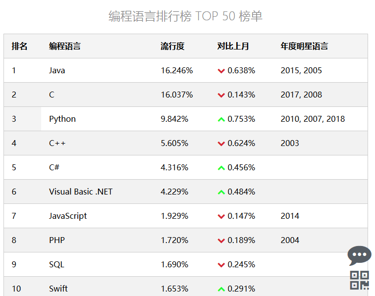
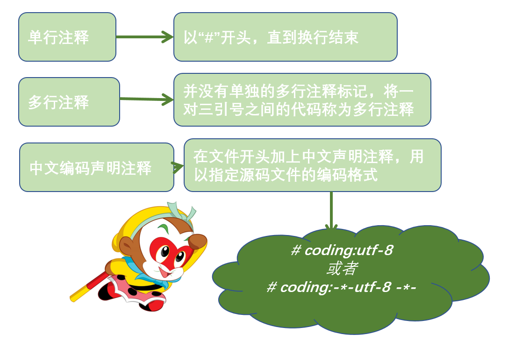
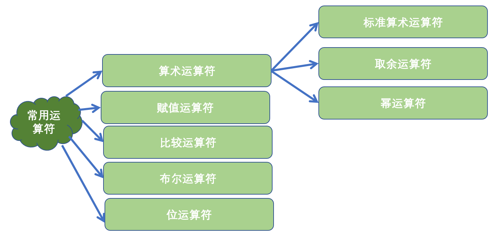
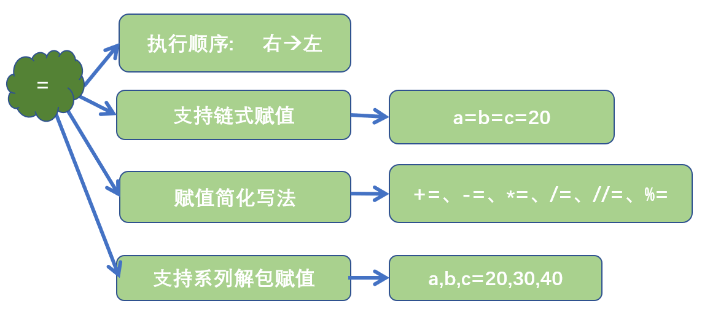
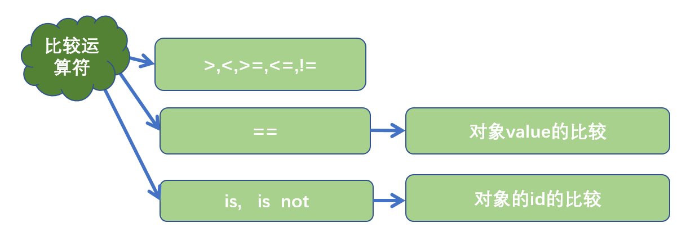
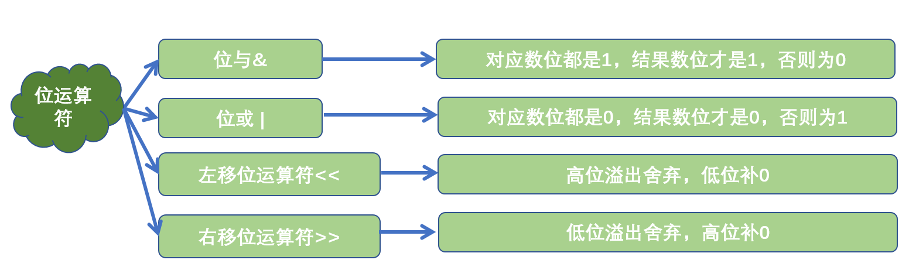

# Python语言入门

人生苦短，我用 Python ——Life is short, you need Python。

## Why Python?

作为实用主义学习者，最关心的问题一定是“我为什么要学习Python，学会之后我可以做什么？”

首先，对于初学者来说，相比其他编程语言，`Python`更容易上手。

Python的设计哲学是`优雅、明确、简单`。在《Python之禅》中有这样一句话：**There should be one, and preferablely only one, obvoius way to do it.**

Python追求的是找到最好的解决方案。而其他语言追求的是多种解决方案。

如果你尝试着读一段Python代码，会发现像阅读英语一样。这也是Python最大的优点，使我们专注于解决问题而不是搞明白语言本身。


## Python 起源

Python 作者，吉多·范罗苏姆（Guido von Rossum），荷兰人，也被亲切地叫做龟叔。1989 年的圣诞节期间，龟叔为了在阿姆斯特丹打发时间，决心开发一个新的解释程序，作为 ABC 语言的一种继承。


* ABC 是由龟叔参加设计的一种教学语言，就龟叔本人看来，ABC这种语言非常优美和强大，是专门为非专业程序员设计的。但是 ABC 语言并没有成功，究其原因，龟叔认为是非开放造成的。龟叔决心在 Python 中避免这一错误，采用开源，并获取了非常好的效果。
* 之所以选中Python（蟒蛇）作为程序的名字，是因为他是BBC电视剧——蒙提·派森的飞行马戏团（Monty Python’s Flying Circus）的爱好者。
* 1991年，第一个Python解释器诞生，它是用C语言实现的，并能够调用C语言的库文件。

Python功能强大，很多功能都被Python 自带的工具包或者第三方开发的工具包实现了。编写程序的时候，`只需要调用工具，而不必重新创造工具`。就像有一部智能手机，可以根据需要安装APP。也可以用混合编译的方式使用c/c++/java等语言的库，又被叫做`胶水语言。`


## Python应用领域

Web应用开发，Python 经常被用于 Web 开发，尽管目前 PHP、JS 依然是 Web 开发的主流语言，但 Python 上升势头更猛劲。尤其随着 Python 的 Web 开发框架逐渐成熟（比如 Django、flask、TurboGears、web2py 等等），程序员可以更轻松地开发和管理复杂的 Web 程序。全球最大的搜索引擎 Google，在其网络搜索系统中就广泛使用 Python 语言。另外，我们经常访问的集电影、读书、音乐于一体的豆瓣网，也是使用 Python 实现的。


* 自动化运维，很多操作系统中，Python 是标准的系统组件，大多数 Linux 发行版以及 NetBSD、OpenBSD 和 Mac OS X 都集成了 Python，可以在终端下直接运行 Python。通常情况下，Python 编写的系统管理脚本，无论是可读性，还是性能、代码重用度以及扩展性方面，都优于普通的 shell 脚本。
*   人工智能领域，人工智能是项目非常火的一个研究方向，如果要评选当前最热、工资最高的 IT 职位，那么人工智能领域的工程师最有话语权。而 Python 在人工智能领域内的机器学习、神经网络、深度学习等方面，都是主流的编程语言。

    可以这么说，基于大数据分析和深度学习发展而来的人工智能，其本质上已经无法离开 Python 的支持了，原因至少有以下几点：

    * 目前世界上优秀的人工智能学习框架，比如 Google 的 TransorFlow（神经网络框架）、FaceBook 的 PyTorch（神经网络框架）以及开源社区的 Karas 神经网络库等，都是用 Python 实现的。
    * 微软的 CNTK（认知工具包）也完全支持 Python，并且该公司开发的 VS Code，也已经把 Python 作为第一级语言进行支持。Python 擅长进行科学计算和数据分析，支持各种数学运算，可以绘制出更高质量的 2D 和 3D 图像。总之，AI 时代的来临，使得 Python 从众多编程语言中脱颖而出，Python 作为 AI 时代头牌语言的位置，基本无人可撼动！
* 网路爬虫，Python 语言很早就用来编写网络爬虫。Google 等搜索引擎公司大量地使用 Python 语言编写网络爬虫。从技术层面上将，Python 提供有很多服务于编写网络爬虫的工具，例如 urllib、Selenium 和 BeautifulSoup 等，还提供了一个网络爬虫框架 Scrapy。
* 科学计算，自 1997 年，NASA 就大量使用 Python 进行各种复杂的科学运算。并且，和其它解释型语言（如 shell、js、PHP）相比，Python 在数据分析、可视化方面有相当完善和优秀的库，例如 NumPy、SciPy、Matplotlib、pandas 等，这可以满足 Python 程序员编写科学计算程序。
* 游戏开发，Python 可以直接调用 Open GL 实现 3D 绘制，这是高性能游戏引擎的技术基础。事实上，有很多 Python 语言实现的游戏引擎，例如 Pygame、Pyglet 以及 Cocos 2d 等。


## 编程语言排行榜



## IDLE安装


Python安装模块：

* Windows系统：`pip install pygame`
* Mac/Ubuntu系统：`sudo pip3 install pygame`
* `pip install -i https://pypi.doubanio.com/simple/ + 模块名称`


## 代码注释

<<<<<<< HEAD

=======

>>>>>>> 5bb58032502c38e9272af61b47bcc31eca621c12

## 字符编码

计算机存储数据都是使用二进制0、1来表示的，我们在屏幕上看到的中文、英文、图片、视频……都是二进制转换后的结果，存储数据时的编码和读取数据时的解码规则都应当一致才能够显示出正确的结果。

**常见的字符编码**

* ASCII码一统天下：（American Standard Code for Information Interchange，美国标准信息交换代码）是基于拉丁字母的一套电脑编码系统，ASCII码中只包含英文字母，数字以及特殊字符与二进制的对应关系，由于现代计算机起源于美国，因此优先考虑仅仅识别英文字符，最多只能用 8 位来表示（一个字节），即：2\*\*8 = 256，所以，ASCII码最多只能表示 256 个符号。


* 诸侯割据
  * 国标GBK：只有中文字符、英文字符和数字的一一对应关系，一个英文字符1Bytes，一个中文字符2Bytes。
  * Shift\_JIS：只有日文字符、英文字符和数字的一一对应关系
  * Euc-kr：只有韩文字符、英文字符和数字的一一对应关系
* 分久必合
  * Unicode： 包含全世界所有的文字与二进制0101001的对应关系。由字符转换成内存中的Unicode以及由Unicode转换成其他编码的过程，都称为编码encode。由内存中的Unicode转换成字符以及由其他编码转换成Unicode的过程，都称为解码decode。任何英文和中文字符都是4个字节。
  * UTF-8：（8-bit Unicode Transformation Format）是一种针对Unicode的可变长度字符编码，又称`万国码`。UTF-8用1到6个字节编码Unicode字符。用在网页上可以统一页面显示中文简体繁体及其它语言（如英文，日文，韩文）。英文——1Bytes，欧洲文字——2Bytes，中文、亚洲文字——3Bytes。


```
单位转换:
8bit = 1byte
1024byte = 1KB
1024KB = 1MB
1024MB = 1GB
1024GB = 1TB
```

## Python中常见运算符

### 算术运算符



|  运算符 |  描述 | 实例                         |
| :--: | :-: | -------------------------- |
|   +  |  加  | 10 + 20 = 30               |
|   -  |  减  | 10 - 20 = -10              |
|  \*  |  乘  | 10 \* 20 = 200             |
|   /  |  除  | 10 / 20 = 0.5              |
|  //  | 取整除 | 返回除法的整数部分（商） 9 // 2 输出结果 4 |
|   %  | 取余数 | 返回除法的余数 9 % 2 = 1          |
| \*\* |  幂  | 又称次方、乘方，2 \*\* 3 = 8       |

### 赋值运算符



### 比较运算符



### 布尔运算符


### 位运算符



## print函数

<<<<<<< HEAD


=======

>>>>>>> 5bb58032502c38e9272af61b47bcc31eca621c12

* print 后面接一对小括号，小括号里面为控制台显示的内容。（注：小括号为英文输入法状态）
* 如果显示字符串，必须使用引号将内容引起来
* 如果显示数值，则不需要引号

```python
print("My name is 黑猫。y")
print(123)
```

#### **"\n"换行符**

```python
print("I love\n")
print("python")

"\n"换行符
结果：
I love

python
```

#### **转义字符**

```python
print('I\'m 20 years old.')

结果：
I'm 20 years old.
```

#### **r防止字符串中的内容被转义**

```python
>>> print(r"I\'m 20 years old.")
I\'m 20 years old.Py
```

#### **"\t"制表符**

```python
print("My name is xuyanpeng.", end="\t")
print("I'm 28 years old.")
结果：
My name is xuyanpeng.	I'm 28y years old.
```

#### **"%"占位符**

```python
print("My name is %s. I'm %d years old." % ("xuyanpeng", 20))
结果：
My name is xuyanpeng. I'm 20 years old.P
```

```python
print("Pi的值是%f" % 3.1415926)
print("Pi的值是%.2f" % 3.1415926)
结果：
Pi的值是3.141593
Pi的值是3.1
```

#### **format格式化函数**

```python
>>> "{} {}".format("hello", "world")
'hello world'
>>> "{1} {0}".format("hello", "world")
'world hello'
>>> "{1} {1} {0}".format("hello", "world")
'world world hello'
```

## 变量

* 变量是内存中一个带标签的盒子
* 变量由三部分组成
  * 标识：表示对象所存储的内存地址，使用内置函数id(obj)来获取
  * 类型 :表示的是对象的数据类型，使用内置函数type(obj)来获取
  * 值:表示对象所存储的具体数据，使用print(obj)可以将值进行打印输出
* p当多次赋值之后，变量名会指向新的空间


| 格式化字符 | 含义                                         |
| ----- | ------------------------------------------ |
| %s    | 字符串                                        |
| %d    | 有符号十进制整数，`%06d` 表示输出的整数显示位数，不足的地方使用 `0` 补全 |
| %f    | 浮点数，`%.2f` 表示小数点后只显示两位                     |
| %%    | 输出 `%`                                     |

#### **变量的引用**

> 变量和数据都是保存在内存中的 在Python中函数的参数传递以及返回值都是靠引用传递的

* 变量中保存着数据在内存中的地址
* 变量中记录数据的地址，就叫做引用
* 使用 id() 函数可以查看变量中保存数据所在的内存地址

> 注意：如果变量已经被定义，当给一个变量赋值的时候，本质上是修改了数据的引用 变量不再对之前的数据引用 变量改为对新赋值的数据引用。

**Python中的标识符和保留字**

```python
import keyword
print(keyword.kwlist)
```


## input()与计算机交互


