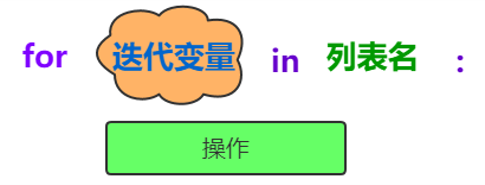

# Python语言入门

>  人生苦短，我用 Python ——Life is short, you need Python。


## Why Python?

作为实用主义学习者，最关心的问题一定是“我为什么要学习Python，学会之后我可以做什么？”

首先，对于初学者来说，相比其他编程语言，`Python`更容易上手。

Python的设计哲学是`优雅、明确、简单`。在《Python之禅》中有这样一句话：`There should be one, and preferablely only one, obvoius way to do it.`

Python追求的是找到最好的解决方案。而其他语言追求的是多种解决方案。

如果你尝试着读一段Python代码，会发现像阅读英语一样。这也是Python最大的优点，使我们`专注于解决问题而不是搞明白语言本身`。


- Python对大数据分析、人工智能中至关重要的机器学习、深度学习都提供了大力的支持
- Python背后有最最庞大的“代码库”
- 可以用混合编译的方式使用c/c++/java等语言的库，又被叫做`胶水语言`


## Python应用领域

Web应用开发，Python 经常被用于 Web 开发，尽管目前 PHP、JS 依然是 Web 开发的主流语言，但 Python 上升势头更猛劲。尤其随着 Python 的 Web 开发框架逐渐成熟（比如 Django、flask、TurboGears、web2py 等等），程序员可以更轻松地开发和管理复杂的 Web 程序。全球最大的搜索引擎 Google，在其网络搜索系统中就广泛使用 Python 语言。另外，我们经常访问的集电影、读书、音乐于一体的豆瓣网，也是使用 Python 实现的。


* 自动化运维，很多操作系统中，Python 是标准的系统组件，大多数 Linux 发行版以及 NetBSD、OpenBSD 和 Mac OS X 都集成了 Python，可以在终端下直接运行 Python。通常情况下，Python 编写的系统管理脚本，无论是可读性，还是性能、代码重用度以及扩展性方面，都优于普通的 shell 脚本。
*   人工智能领域，人工智能是项目非常火的一个研究方向，如果要评选当前最热、工资最高的 IT 职位，那么人工智能领域的工程师最有话语权。而 Python 在人工智能领域内的机器学习、神经网络、深度学习等方面，都是主流的编程语言。

    可以这么说，基于大数据分析和深度学习发展而来的人工智能，其本质上已经无法离开 Python 的支持了，原因至少有以下几点：

    * 目前世界上优秀的人工智能学习框架，比如 Google 的 TransorFlow（神经网络框架）、FaceBook 的 PyTorch（神经网络框架）以及开源社区的 Karas 神经网络库等，都是用 Python 实现的。
    * 微软的 CNTK（认知工具包）也完全支持 Python，并且该公司开发的 VS Code，也已经把 Python 作为第一级语言进行支持。Python 擅长进行科学计算和数据分析，支持各种数学运算，可以绘制出更高质量的 2D 和 3D 图像。总之，AI 时代的来临，使得 Python 从众多编程语言中脱颖而出，Python 作为 AI 时代头牌语言的位置，基本无人可撼动！
* 网路爬虫，Python 语言很早就用来编写网络爬虫。Google 等搜索引擎公司大量地使用 Python 语言编写网络爬虫。从技术层面上将，Python 提供有很多服务于编写网络爬虫的工具，例如 urllib、Selenium 和 BeautifulSoup 等，还提供了一个网络爬虫框架 Scrapy。
* 科学计算，自 1997 年，NASA 就大量使用 Python 进行各种复杂的科学运算。并且，和其它解释型语言（如 shell、js、PHP）相比，Python 在数据分析、可视化方面有相当完善和优秀的库，例如 NumPy、SciPy、Matplotlib、pandas 等，这可以满足 Python 程序员编写科学计算程序。
* 游戏开发，Python 可以直接调用 Open GL 实现 3D 绘制，这是高性能游戏引擎的技术基础。事实上，有很多 Python 语言实现的游戏引擎，例如 Pygame、Pyglet 以及 Cocos 2d 等。


## Python 起源

Python 作者，吉多·范罗苏姆（Guido von Rossum），荷兰人，也被亲切地叫做龟叔。1989 年的圣诞节期间，龟叔为了在阿姆斯特丹打发时间，决心开发一个新的解释程序，作为 ABC 语言的一种继承。


* ABC 是由龟叔参加设计的一种教学语言，就龟叔本人看来，ABC这种语言非常优美和强大，是专门为非专业程序员设计的。但是 ABC 语言并没有成功，究其原因，龟叔认为是非开放造成的。龟叔决心在 Python 中避免这一错误，采用开源，并获取了非常好的效果。
* 之所以选中Python（蟒蛇）作为程序的名字，是因为他是BBC电视剧——蒙提·派森的飞行马戏团（Monty Python’s Flying Circus）的爱好者。
* 1991年，第一个Python解释器诞生，它是用C语言实现的，并能够调用C语言的库文件。

Python功能强大，很多功能都被Python 自带的工具包或者第三方开发的工具包实现了。编写程序的时候，`只需要调用工具，而不必重新创造工具`。就像有一部智能手机，可以根据需要安装APP。也可以用混合编译的方式使用c/c++/java等语言的库，又被叫做`胶水语言。`


## IDLE安装


Python安装模块：

* Windows系统：`pip install pygame`
* Mac/Ubuntu系统：`sudo pip3 install pygame`
* `pip install -i https://pypi.doubanio.com/simple/ + 模块名称`


# 打印你最喜欢的一句话

## print函数


* print 后面接一对小括号，小括号里面为控制台显示的内容。（注：小括号为英文输入法状态）
* 如果显示字符串，必须使用引号将内容引起来
* 如果显示数值，则不需要引号


**常用转义字符**


| 格式化字符 | 含义                                         |
| ----- | ------------------------------------------ |
| %s    | 字符串                                        |
| %d    | 有符号十进制整数，`%06d` 表示输出的整数显示位数，不足的地方使用 `0` 补全 |
| %f    | 浮点数，`%.2f` 表示小数点后只显示两位                     |
| %%    | 输出 `%`                                     |


## 代码注释


## 一切皆是二进制


## 字符编码

计算机存储数据都是使用二进制0、1来表示的，我们在屏幕上看到的中文、英文、图片、视频……都是二进制转换后的结果，存储数据时的编码和读取数据时的解码规则都应当一致才能够显示出正确的结果。

**常见的字符编码**

* ASCII码一统天下：（American Standard Code for Information Interchange，美国标准信息交换代码）是基于拉丁字母的一套电脑编码系统，ASCII码中只包含英文字母，数字以及特殊字符与二进制的对应关系，由于现代计算机起源于美国，因此优先考虑仅仅识别英文字符，最多只能用 8 位来表示（一个字节），即：$2^8$ = 256，所以，ASCII码最多只能表示 256 个符号。


* 诸侯割据
  * 国标GBK：只有中文字符、英文字符和数字的一一对应关系，一个英文字符1Bytes，一个中文字符2Bytes。
  * Shift\_JIS：只有日文字符、英文字符和数字的一一对应关系
  * Euc-kr：只有韩文字符、英文字符和数字的一一对应关系
* 分久必合
  * Unicode： 包含全世界所有的文字与二进制0101001的对应关系。由字符转换成内存中的Unicode以及由Unicode转换成其他编码的过程，都称为编码encode。由内存中的Unicode转换成字符以及由其他编码转换成Unicode的过程，都称为解码decode。任何英文和中文字符都是4个字节。
  * UTF-8：（8-bit Unicode Transformation Format）是一种针对Unicode的可变长度字符编码，又称`万国码`。UTF-8用1到6个字节编码Unicode字符。用在网页上可以统一页面显示中文简体繁体及其它语言（如英文，日文，韩文）。英文——1Bytes，欧洲文字——2Bytes，中文、亚洲文字——3Bytes。


```
单位转换:
8bit = 1byte
1024byte = 1KB
1024KB = 1MB
1024MB = 1GB
1024GB = 1TB
```


# 灵活的变量

* 变量是内存中一个带`标签`的盒子
* 变量由三部分组成
  * 标识符：表示对象所存储的内存地址，使用内置函数`id(obj)`来获取
  * 类型 :表示的是对象的数据类型，使用内置函数`type(obj)`来获取
  * 值:表示对象所存储的具体数据，使用`print(obj)`可以将值进行打印输出
* 当多次赋值之后，变量名会指向新的空间


**Python中的标识符和保留字**

```python
import keyword
print(keyword.kwlist)
```


## 基础数据类型

### int 整形(integer)

* 整数类型：\_英文为`integer`**，简写为`int`，可以表示\_正数、负数和零
* 整数的不同进制表示方式
  * 十进制->默认的进制
  * 二进制->以0b开头
  * 八进制->以0o开头
  * 十六进制->0x开头
  


### 浮点型（float）
- 浮点数整数部分和小数部分组成
- 浮点数存储不精确性：使用浮点数进行计算时，可能会出现小数位数不确定的情况

```python
print(1.1+2.2) #3.3000000000000003
print(1.1+2.1) #3.2
```


- 解决方案：导入模块decimal

```python
from decimal import Decimal
print(Decimal('1.1')+Decimal('2.2')) # 3.3
```


### 布尔类型(Bool)

- 用来表示真或假的值

- True表示真，False表示假

- 布尔值可以转化为整数 
  - True  1
  - False  0

```python
print(True+1)  # 2
print(False+1) # 1
```


### 字符串(String)

- 字符串又被称为不可变的字符序列
- 可以使用单引号`’ ’ `双引号`” ” `三引号`’’’ ’’’ `或`””” ”””`来定义
- 单引号和双引号定义的字符串必须在一行
- 三引号定义的字符串可以分布在连续的多行 


```python
a = "abcdefghijklmnopqrstuvwxyz"  
  
print(a[0])             # a  
print(a[3])             # d  
print(a[5:8])           # fgh  
print(a[:-1])           # abcdefghijklmnopqrstuvwxy  
print(a[:10:3])         # adgj  
print(a[-3:-15:-3])     # xuro 
```


### 数据类型转换

> 将不同数据类型的数据拼接在一起


## input()与计算机交互


## Python中的运算符


### **算术运算符**


### **赋值运算符**


### **比较运算符**


### **布尔运算符**


### **位运算符**


### **运算符的优先级**


### 对象None

> 对象None用于表示数据值的不存在,但在内存中占用一定的空间。


 

# 条件判断


## **程序的组织结构**

> 1996年，计算机科学家证明了这样的事实：任何简单或复杂的算法都可以由顺序结构、选择结构和循环结构这三种基本结构组合而成。


## **顺序结构**

> 程序从上到下顺序地执行代码，中间没有任何的判断和跳转，直到程序结束。


## **对象的布尔值**

- Python一切皆对象，所有对象都有一个布尔值
- 获取对象的布尔值：使用内置函数`bool()`
- 以下对象的布尔值为False
  - False
  - 数值
  - None
  - 空字符串
  - 空列表
  - 空元组
  - 空字典
  - 空集合


## 选择结构

- 程序根据判断条件的布尔值选择性地执行部分代码

- 明确的让计算机知道在什么条件下，该去做什么


### 单分支结构


### 双分支结构


### 多分支结构


### if嵌套


# 循环结构

> 反复做同一件事情的情况，称为循环


## while循环


```python
i = 1
while i<=100:
    print(i)
    i += 1
print("over!")
```


**猜数字**


```python
import random

computer = random.randint(1, 100)
player = int(input("num >> "))

cnt = 1
while computer != player:
    if player > computer:
        print("第%d次，猜大了" % cnt)
    if player < computer:
        print("第%d次，猜小了" % cnt)
    player = int(input("num >> "))
    cnt += 1

print("恭喜你，第%d次，猜对了" % cnt)
```


## for-in循环

- in表示从（字符串、序列等）中依次取值，又称为`遍历`
- for-in遍历的对象必须是`可迭代对象`


## 内置函数range()

- 用于生成一个`整数`序列
- 创建range对象的三种方式


- 返回值是一个`迭代器`对象
- range类型的优点 :不管range对象表示的整数序列有多长，所有range对象占用的内存空间都是相同的，因为仅仅需要存储start,stop和step，只有当用到range对象时，才会去计算序列中的相关元素
- `in`与`not in`判断整数序列中是否存在（不存在）指定的整数 


## 循环跳出

- break语句：用于`结束循环结构`，通常与分支结构if一起使用


- continue语句：用于`结束当前循环`，进入下一次循环,通常与分支结构中的if一起使用


- 二重循环中的break和continue用于控制`本层循环`


## 循环嵌套

> 循环结构中又嵌套了另外的完整的循环结构，其中内层循环做为外层循环的循环体执行。


```python
for i in range(1, 10):
    for j in range(1, i+1):
        print("%d*%d=%d" % (i, j, i*j), end="\t")
    print()
```


## **百钱买百鸡问题**

> 鸡翁一，值钱五，鸡母一，值钱三，鸡雏三，值钱一，百钱买百鸡，问鸡翁、鸡母、鸡雏各几何？

```python
for i in range(0, 21):
    for j in range(0, 34):
        k = 100-i-j
        if (i*5+j*3+k//3==100) and (k%3==0):
            print(i, j, k)
```


## 总结


# 打了激素的列表

> 变量可以存储一个元素，而列表是一个“大容器”可以存储N多个元素，程序可以方便地对这些数据进行整体操作。


**列表的创建**：列表需要使用中括号[],元素之间使用英文的逗号进行分隔


- 创建方式
  - 使用中`括号`
  - 调用内置函数`list()`

```python
lst=['黑猫','徐筵彭']
lst2=list([‘黑猫’,‘徐筵彭'])
```


**列表的特点**


**获取列表中的单个元素**


**获取列表中指定元素索引**


**列表切片查询**


**判断指定元素在列表中是否存在**


**列表元素的遍历**



**列表元素的增加操作**


**列表元素的删除操作**


**列表元素的排序操作**

- 调用`sort()`方法，列有中的所有元素默认按照从小到大的顺序进行排序，可以 指定 reverse=True，进行降序 排序
- 调用内置函数`sorted()`，可以指定reverse=True，进行降序排序，`原列表不发生改变`

```python
li = [3, 1, 2, 4, 5]
# li.sort(reverse=True)
# print(li)

li2 = sorted(li, reverse=True)
print(li, li2)
```


**列表生成式**：即`生成列表的公式`


## 总结


## 快乐刷题

- [P1 伟大的开始——Hello,World!](http://www.blackcat1995.com/problem/1)
- [P26 A+B问题](http://www.blackcat1995.com/problem/26)
- [P34 小玉买文具](http://www.blackcat1995.com/problem/34)
- [P35 苹果和虫子](http://www.blackcat1995.com/problem/35)
- [P47 尼克与强盗](http://www.blackcat1995.com/problem/47)
- [P143 判断闰年](http://www.blackcat1995.com/problem/143)
- [P12 求三个数中最大数](http://www.blackcat1995.com/problem/12)
- [P25 删除试题](http://www.blackcat1995.com/problem/25)
- [P9 高个子的人数](http://www.blackcat1995.com/problem/9)
- [P16 插队问题](http://www.blackcat1995.com/problem/16)


# 成双成对的字典

- Python内置的数据结构之一，与列表一样是一个`可变序列`
- 以`键值对`的方式存储数据，字典是一个`无序的序列`


## 字典的实现原理

字典的实现原理与查字典类似，查字典是先根据部首或拼音查找汉字对应的页码，Python中的字典是根据key查找value所在的位置。


## 字典的创建

- 最常用的方式：使用花括号 


- 使用内置函数`dict()`


## **字典的常用操作**

### 字典中元素的获取


- `[]取值`：如果字典中不存在指定的key，抛出keyError异常
- `get()方法取值`，如果字典中不存在指定的key，并不会抛出KeyError而是返回None，可以通过参数设置默认的value，以便指定的key不存在时返回

### key的判断


### 字典元素的删除


### 字典元素的新增


### 获取字典视图的三种方法


### 字典元素的遍历


## **字典的特点**

- 字典中的所有元素都是一个 key-value对，`key不允许重复`， value可以重复

- 字典中的元素是`无序`的

- 字典中的`key`必须是`不可变`对象 

- 字典也可以根据需要动态地伸缩

- 字典会浪费较大的内存，是一种使用`空间换时间`的数据结构


## **zip和字典生成式**

- 内置函数`zip()`


- 字典生成式


## 总结


# 元组和集合

Python内置的数据结构之一，是一个`不可变序列`

不变可变序列：比如字符串、元组，没有`增、删，改`的操作

可变序列：比如列表、字典`执行增、删、改`操作，`对象地址不发生更改`


## 元组的创建方式

- 直接小括号


- 使用内置函数`tuple()`


- 只包含一个元组的元素需要使用逗号和小括号


## **为什么要将元组设计成不可变序列**

- 在多任务环境下，同时操作对象时不需要加锁
- **注意事项：**元组中存储的是对象的引用
  - 如果元组中对象本身不可变对象，则不能再引用其它对象
  - 如果元组中的对象是可变对象，则可变对象的引用不允许改变，但数据可以改变


## **元组的遍历**


## **什么是集合**

- Python语言提供的内置数据结构

- 与列表、字典一样都属于可变类型的序列

- 集合是没有value的字典


## **集合的创建方式**

- 直接`{ }`


- 使用内置函数`set()`


## **集合的相关操作**

- **集合元素的判断操作**：`in`或`not in`

- **集合元素的新增操作**
  - 调用`add()`方法，一次添加一个元素
  - 调用update()方法至少添加一个元素
  
- **集合元素的删除操作** 

  - 调用remove()方法，一次删除一个指定元素，如果指定的元素不存在抛出KeyError
  - 调用discard()方法，一次删除一个指定元素，如果指定的元素不存在不抛异常
  - 调用pop()方法，一次只删除一个任意元素
  - 调用clear()方法，清空集合
  
  

## **集合间的关系**

- 两个集合是否相等：可以使用运算符`==`或`!=`进行判断
- 一个集合是否是另一个集合的`子集`：可以调用方法issubset进行判断B是否是A的子集
- 一个集合是否是另一个集合的`超集`：可以调用方法issuperset进行判断A是否是B的超集

- 两个集合是否有交集 ：可以调用方法isdisjoint进行判断


## **集合的数学操作**


## **集合生成式**


## 总结


# 正则表达式

正则表达式并不是Python的一部分。正则表达式是用于处理字符串的强大工具，拥有自己独特的语法以及一个独立的处理引擎，效率上可能不如str自带的方法，但功能十分强大。


## 使用match方法进行匹配操作

`result = re.match(正则表达式,要匹配的字符串)`

如果上一步匹配到数据的话，可以使用group方法来提取数据：`result.group()`

```python
import re
result = re.match("black", "blackcat")
print(result.group())
```


##  匹配单个字符

| 字符 | 功能                             |
| :--: | :------------------------------- |
|  .   | 匹配任意1个字符（除了\n）        |
| [ ]  | 匹配[ ]中列举的字符              |
|  \d  | 匹配数字，即0-9                  |
|  \D  | 匹配非数字，即不是数字           |
|  \s  | 匹配空白，即 空格，tab键         |
|  \S  | 匹配非空白                       |
|  \w  | 匹配单词字符，即a-z、A-Z、0-9、_ |
|  \W  | 匹配非单词字符                   |


## 匹配多个字符

| 字符  | 功能                                                |
| :---: | :-------------------------------------------------- |
|   *   | 匹配前一个字符出现0次或者无限次，即可有可无         |
|   +   | 匹配前一个字符出现1次或者无限次，即至少有1次        |
|   ?   | 匹配前一个字符出现1次或者0次，即要么有1次，要么没有 |
|  {m}  | 匹配前一个字符出现m次                               |
| {m,n} | 匹配前一个字符出现从m到n次                          |


## 匹配开头结尾

| 字符 | 功能           |
| :--: | :------------- |
|  ^   | 匹配字符串开头 |
|  $   | 匹配字符串结尾 |


## 匹配分组

|     字符     | 功能                             |
| :----------: | :------------------------------- |
|      \|      | 匹配左右任意一个表达式           |
|     (ab)     | 将括号中字符作为一个分组         |
|    `\num`    | 引用分组num匹配到的字符串        |
| `(?P<name>)` | 分组起别名                       |
|  (?P=name)   | 引用别名为name分组匹配到的字符串 |


## re高级用法

- search：在目标字符串的任意位置，成功匹配一次就结束，不会进行多次匹配。
- findall：在整个字符串中搜索所有符合正则表达式的字符串，并以列表的形式返回。如果匹配成功，则返回包含匹配
  结构的`列表`，否则返回空列表。
- sub：将匹配到的数据进行替换。

