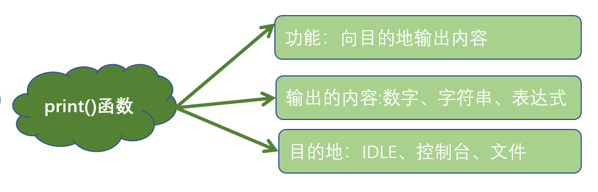

# Python语言入门

>  人生苦短，我用 Python ——Life is short, you need Python。


## Why Python?

作为实用主义学习者，最关心的问题一定是“我为什么要学习Python，学会之后我可以做什么？”

首先，对于初学者来说，相比其他编程语言，`Python`更容易上手。

Python的设计哲学是`优雅、明确、简单`。在《Python之禅》中有这样一句话：`There should be one, and preferablely only one, obvoius way to do it.`

Python追求的是找到最好的解决方案。而其他语言追求的是多种解决方案。

如果你尝试着读一段Python代码，会发现像阅读英语一样。这也是Python最大的优点，使我们`专注于解决问题而不是搞明白语言本身`。


- Python对大数据分析、人工智能中至关重要的机器学习、深度学习都提供了大力的支持
- Python背后有最最庞大的“代码库”
- 可以用混合编译的方式使用c/c++/java等语言的库，又被叫做`胶水语言`


## Python应用领域

Web应用开发，Python 经常被用于 Web 开发，尽管目前 PHP、JS 依然是 Web 开发的主流语言，但 Python 上升势头更猛劲。尤其随着 Python 的 Web 开发框架逐渐成熟（比如 Django、flask、TurboGears、web2py 等等），程序员可以更轻松地开发和管理复杂的 Web 程序。全球最大的搜索引擎 Google，在其网络搜索系统中就广泛使用 Python 语言。另外，我们经常访问的集电影、读书、音乐于一体的豆瓣网，也是使用 Python 实现的。


* 自动化运维，很多操作系统中，Python 是标准的系统组件，大多数 Linux 发行版以及 NetBSD、OpenBSD 和 Mac OS X 都集成了 Python，可以在终端下直接运行 Python。通常情况下，Python 编写的系统管理脚本，无论是可读性，还是性能、代码重用度以及扩展性方面，都优于普通的 shell 脚本。
*   人工智能领域，人工智能是项目非常火的一个研究方向，如果要评选当前最热、工资最高的 IT 职位，那么人工智能领域的工程师最有话语权。而 Python 在人工智能领域内的机器学习、神经网络、深度学习等方面，都是主流的编程语言。

    可以这么说，基于大数据分析和深度学习发展而来的人工智能，其本质上已经无法离开 Python 的支持了，原因至少有以下几点：

    * 目前世界上优秀的人工智能学习框架，比如 Google 的 TransorFlow（神经网络框架）、FaceBook 的 PyTorch（神经网络框架）以及开源社区的 Karas 神经网络库等，都是用 Python 实现的。
    * 微软的 CNTK（认知工具包）也完全支持 Python，并且该公司开发的 VS Code，也已经把 Python 作为第一级语言进行支持。Python 擅长进行科学计算和数据分析，支持各种数学运算，可以绘制出更高质量的 2D 和 3D 图像。总之，AI 时代的来临，使得 Python 从众多编程语言中脱颖而出，Python 作为 AI 时代头牌语言的位置，基本无人可撼动！
* 网路爬虫，Python 语言很早就用来编写网络爬虫。Google 等搜索引擎公司大量地使用 Python 语言编写网络爬虫。从技术层面上将，Python 提供有很多服务于编写网络爬虫的工具，例如 urllib、Selenium 和 BeautifulSoup 等，还提供了一个网络爬虫框架 Scrapy。
* 科学计算，自 1997 年，NASA 就大量使用 Python 进行各种复杂的科学运算。并且，和其它解释型语言（如 shell、js、PHP）相比，Python 在数据分析、可视化方面有相当完善和优秀的库，例如 NumPy、SciPy、Matplotlib、pandas 等，这可以满足 Python 程序员编写科学计算程序。
* 游戏开发，Python 可以直接调用 Open GL 实现 3D 绘制，这是高性能游戏引擎的技术基础。事实上，有很多 Python 语言实现的游戏引擎，例如 Pygame、Pyglet 以及 Cocos 2d 等。


## Python 起源

Python 作者，吉多·范罗苏姆（Guido von Rossum），荷兰人，也被亲切地叫做龟叔。1989 年的圣诞节期间，龟叔为了在阿姆斯特丹打发时间，决心开发一个新的解释程序，作为 ABC 语言的一种继承。


* ABC 是由龟叔参加设计的一种教学语言，就龟叔本人看来，ABC这种语言非常优美和强大，是专门为非专业程序员设计的。但是 ABC 语言并没有成功，究其原因，龟叔认为是非开放造成的。龟叔决心在 Python 中避免这一错误，采用开源，并获取了非常好的效果。
* 之所以选中Python（蟒蛇）作为程序的名字，是因为他是BBC电视剧——蒙提·派森的飞行马戏团（Monty Python’s Flying Circus）的爱好者。
* 1991年，第一个Python解释器诞生，它是用C语言实现的，并能够调用C语言的库文件。

Python功能强大，很多功能都被Python 自带的工具包或者第三方开发的工具包实现了。编写程序的时候，`只需要调用工具，而不必重新创造工具`。就像有一部智能手机，可以根据需要安装APP。也可以用混合编译的方式使用c/c++/java等语言的库，又被叫做`胶水语言。`


## IDLE安装


Python安装模块：

* Windows系统：`pip install pygame`
* Mac/Ubuntu系统：`sudo pip3 install pygame`
* `pip install -i https://pypi.doubanio.com/simple/ + 模块名称`


# 打印你最喜欢的一句话

## print函数



* print 后面接一对小括号，小括号里面为控制台显示的内容。（注：小括号为英文输入法状态）
* 如果显示字符串，必须使用引号将内容引起来
* 如果显示数值，则不需要引号


**常用转义字符**


| 格式化字符 | 含义                                         |
| ----- | ------------------------------------------ |
| %s    | 字符串                                        |
| %d    | 有符号十进制整数，`%06d` 表示输出的整数显示位数，不足的地方使用 `0` 补全 |
| %f    | 浮点数，`%.2f` 表示小数点后只显示两位                     |
| %%    | 输出 `%`                                     |


## 代码注释


## 一切皆是二进制


## 字符编码

计算机存储数据都是使用二进制0、1来表示的，我们在屏幕上看到的中文、英文、图片、视频……都是二进制转换后的结果，存储数据时的编码和读取数据时的解码规则都应当一致才能够显示出正确的结果。

**常见的字符编码**

* ASCII码一统天下：（American Standard Code for Information Interchange，美国标准信息交换代码）是基于拉丁字母的一套电脑编码系统，ASCII码中只包含英文字母，数字以及特殊字符与二进制的对应关系，由于现代计算机起源于美国，因此优先考虑仅仅识别英文字符，最多只能用 8 位来表示（一个字节），即：$2^8$ = 256，所以，ASCII码最多只能表示 256 个符号。


* 诸侯割据
  * 国标GBK：只有中文字符、英文字符和数字的一一对应关系，一个英文字符1Bytes，一个中文字符2Bytes。
  * Shift\_JIS：只有日文字符、英文字符和数字的一一对应关系
  * Euc-kr：只有韩文字符、英文字符和数字的一一对应关系
* 分久必合
  * Unicode： 包含全世界所有的文字与二进制0101001的对应关系。由字符转换成内存中的Unicode以及由Unicode转换成其他编码的过程，都称为编码encode。由内存中的Unicode转换成字符以及由其他编码转换成Unicode的过程，都称为解码decode。任何英文和中文字符都是4个字节。
  * UTF-8：（8-bit Unicode Transformation Format）是一种针对Unicode的可变长度字符编码，又称`万国码`。UTF-8用1到6个字节编码Unicode字符。用在网页上可以统一页面显示中文简体繁体及其它语言（如英文，日文，韩文）。英文——1Bytes，欧洲文字——2Bytes，中文、亚洲文字——3Bytes。


```
单位转换:
8bit = 1byte
1024byte = 1KB
1024KB = 1MB
1024MB = 1GB
1024GB = 1TB
```


# 灵活的变量

* 变量是内存中一个带`标签`的盒子
* 变量由三部分组成
  * 标识符：表示对象所存储的内存地址，使用内置函数`id(obj)`来获取
  * 类型 :表示的是对象的数据类型，使用内置函数`type(obj)`来获取
  * 值:表示对象所存储的具体数据，使用`print(obj)`可以将值进行打印输出
* 当多次赋值之后，变量名会指向新的空间


**Python中的标识符和保留字**

```python
import keyword
print(keyword.kwlist)
```


## 基础数据类型

### int 整形(integer)

* 整数类型：\_英文为`integer`**，简写为`int`，可以表示\_正数、负数和零
* 整数的不同进制表示方式
  * 十进制->默认的进制
  * 二进制->以0b开头
  * 八进制->以0o开头
  * 十六进制->0x开头
  


### 浮点型（float）
- 浮点数整数部分和小数部分组成
- 浮点数存储不精确性：使用浮点数进行计算时，可能会出现小数位数不确定的情况

```python
print(1.1+2.2) #3.3000000000000003
print(1.1+2.1) #3.2
```


- 解决方案：导入模块decimal

```python
from decimal import Decimal
print(Decimal('1.1')+Decimal('2.2')) # 3.3
```


### 布尔类型(Bool)

- 用来表示真或假的值

- True表示真，False表示假

- 布尔值可以转化为整数 
  - True  1
  - False  0

```python
print(True+1)  # 2
print(False+1) # 1
```


### 字符串(String)

- 字符串又被称为不可变的字符序列
- 可以使用单引号`’ ’ `双引号`” ” `三引号`’’’ ’’’ `或`””” ”””`来定义
- 单引号和双引号定义的字符串必须在一行
- 三引号定义的字符串可以分布在连续的多行 


```python
a = "abcdefghijklmnopqrstuvwxyz"  
  
print(a[0])             # a  
print(a[3])             # d  
print(a[5:8])           # fgh  
print(a[:-1])           # abcdefghijklmnopqrstuvwxy  
print(a[:10:3])         # adgj  
print(a[-3:-15:-3])     # xuro 
```


### 数据类型转换

> 将不同数据类型的数据拼接在一起


## input()与计算机交互


## Python中的运算符


### **算术运算符**


### **赋值运算符**


### **比较运算符**


### **布尔运算符**


### **位运算符**


### **运算符的优先级**


### 对象None

> 对象None用于表示数据值的不存在,但在内存中占用一定的空间。


 

# 条件判断


## **程序的组织结构**

> 1996年，计算机科学家证明了这样的事实：任何简单或复杂的算法都可以由顺序结构、选择结构和循环结构这三种基本结构组合而成。


## **顺序结构**

> 程序从上到下顺序地执行代码，中间没有任何的判断和跳转，直到程序结束。


## **对象的布尔值**

- Python一切皆对象，所有对象都有一个布尔值
- 获取对象的布尔值：使用内置函数`bool()`
- 以下对象的布尔值为False
  - False
  - 数值
  - None
  - 空字符串
  - 空列表
  - 空元组
  - 空字典
  - 空集合


## 选择结构

- 程序根据判断条件的布尔值选择性地执行部分代码

- 明确的让计算机知道在什么条件下，该去做什么


### 单分支结构


### 双分支结构


### 多分支结构


### if嵌套


# 循环结构

> 反复做同一件事情的情况，称为循环


## while循环


```python
i = 1
while i<=100:
    print(i)
    i += 1
print("over!")
```


**猜数字**


```python
import random

computer = random.randint(1, 100)
player = int(input("num >> "))

cnt = 1
while computer != player:
    if player > computer:
        print("第%d次，猜大了" % cnt)
    if player < computer:
        print("第%d次，猜小了" % cnt)
    player = int(input("num >> "))
    cnt += 1

print("恭喜你，第%d次，猜对了" % cnt)
```


## for-in循环

- in表示从（字符串、序列等）中依次取值，又称为`遍历`
- for-in遍历的对象必须是`可迭代对象`


## 内置函数range()

- 用于生成一个`整数`序列
- 创建range对象的三种方式


- 返回值是一个`迭代器`对象
- range类型的优点 :不管range对象表示的整数序列有多长，所有range对象占用的内存空间都是相同的，因为仅仅需要存储start,stop和step，只有当用到range对象时，才会去计算序列中的相关元素
- `in`与`not in`判断整数序列中是否存在（不存在）指定的整数 


## 循环跳出

- break语句：用于`结束循环结构`，通常与分支结构if一起使用


- continue语句：用于`结束当前循环`，进入下一次循环,通常与分支结构中的if一起使用


- 二重循环中的break和continue用于控制`本层循环`


## 循环嵌套

> 循环结构中又嵌套了另外的完整的循环结构，其中内层循环做为外层循环的循环体执行。


```python
for i in range(1, 10):
    for j in range(1, i+1):
        print("%d*%d=%d" % (i, j, i*j), end="\t")
    print()
```


## **百钱买百鸡问题**

> 鸡翁一，值钱五，鸡母一，值钱三，鸡雏三，值钱一，百钱买百鸡，问鸡翁、鸡母、鸡雏各几何？

```python
for i in range(0, 21):
    for j in range(0, 34):
        k = 100-i-j
        if (i*5+j*3+k//3==100) and (k%3==0):
            print(i, j, k)
```


## 总结


# 打了激素的列表

> 变量可以存储一个元素，而列表是一个“大容器”可以存储N多个元素，程序可以方便地对这些数据进行整体操作。


**列表的创建**：列表需要使用中括号[],元素之间使用英文的逗号进行分隔


- 创建方式
  - 使用中`括号`
  - 调用内置函数`list()`

```python
lst=['黑猫','徐筵彭']
lst2=list([‘黑猫’,‘徐筵彭'])
```


**列表的特点**


**获取列表中的单个元素**


**获取列表中指定元素索引**


**列表切片查询**


**判断指定元素在列表中是否存在**


**列表元素的遍历**


**列表元素的增加操作**


**列表元素的删除操作**


**列表元素的排序操作**

- 调用`sort()`方法，列有中的所有元素默认按照从小到大的顺序进行排序，可以 指定 reverse=True，进行降序 排序
- 调用内置函数`sorted()`，可以指定reverse=True，进行降序排序，`原列表不发生改变`

```python
li = [3, 1, 2, 4, 5]
# li.sort(reverse=True)
# print(li)

li2 = sorted(li, reverse=True)
print(li, li2)
```


**列表生成式**：即`生成列表的公式`


## 总结


## 快乐刷题

- [P1 伟大的开始——Hello,World!](http://www.blackcat1995.com/problem/1)
- [P26 A+B问题](http://www.blackcat1995.com/problem/26)
- [P34 小玉买文具](http://www.blackcat1995.com/problem/34)
- [P35 苹果和虫子](http://www.blackcat1995.com/problem/35)
- [P47 尼克与强盗](http://www.blackcat1995.com/problem/47)
- [P143 判断闰年](http://www.blackcat1995.com/problem/143)
- [P12 求三个数中最大数](http://www.blackcat1995.com/problem/12)
- [P25 删除试题](http://www.blackcat1995.com/problem/25)
- [P9 高个子的人数](http://www.blackcat1995.com/problem/9)
- [P16 插队问题](http://www.blackcat1995.com/problem/16)


# 成双成对的字典

- Python内置的数据结构之一，与列表一样是一个`可变序列`
- 以`键值对`的方式存储数据，字典是一个`无序的序列`


## 字典的实现原理

字典的实现原理与查字典类似，查字典是先根据部首或拼音查找汉字对应的页码，Python中的字典是根据key查找value所在的位置。


## 字典的创建

- 最常用的方式：使用花括号 


- 使用内置函数`dict()`


## **字典的常用操作**

### 字典中元素的获取


- `[]取值`：如果字典中不存在指定的key，抛出keyError异常
- `get()方法取值`，如果字典中不存在指定的key，并不会抛出KeyError而是返回None，可以通过参数设置默认的value，以便指定的key不存在时返回

### key的判断


### 字典元素的删除


### 字典元素的新增


### 获取字典视图的三种方法


### 字典元素的遍历


## **字典的特点**

- 字典中的所有元素都是一个 key-value对，`key不允许重复`， value可以重复

- 字典中的元素是`无序`的

- 字典中的`key`必须是`不可变`对象 

- 字典也可以根据需要动态地伸缩

- 字典会浪费较大的内存，是一种使用`空间换时间`的数据结构


## **zip和字典生成式**

- 内置函数`zip()`


- 字典生成式


## 总结


# 元组和集合

Python内置的数据结构之一，是一个`不可变序列`

不变可变序列：比如字符串、元组，没有`增、删，改`的操作

可变序列：比如列表、字典`执行增、删、改`操作，`对象地址不发生更改`


## 元组的创建方式

- 直接小括号


- 使用内置函数`tuple()`


- 只包含一个元组的元素需要使用逗号和小括号


## **为什么要将元组设计成不可变序列**

- 在多任务环境下，同时操作对象时不需要加锁
- **注意事项：**元组中存储的是对象的引用
  - 如果元组中对象本身不可变对象，则不能再引用其它对象
  - 如果元组中的对象是可变对象，则可变对象的引用不允许改变，但数据可以改变


## **元组的遍历**


## **什么是集合**

- Python语言提供的内置数据结构

- 与列表、字典一样都属于可变类型的序列

- 集合是没有value的字典


## **集合的创建方式**

- 直接`{ }`


- 使用内置函数`set()`


## **集合的相关操作**

- **集合元素的判断操作**：`in`或`not in`

- **集合元素的新增操作**
  - 调用`add()`方法，一次添加一个元素
  - 调用update()方法至少添加一个元素
  
- **集合元素的删除操作** 

  - 调用remove()方法，一次删除一个指定元素，如果指定的元素不存在抛出KeyError
  - 调用discard()方法，一次删除一个指定元素，如果指定的元素不存在不抛异常
  - 调用pop()方法，一次只删除一个任意元素
  - 调用clear()方法，清空集合
  
  

## **集合间的关系**

- 两个集合是否相等：可以使用运算符`==`或`!=`进行判断
- 一个集合是否是另一个集合的`子集`：可以调用方法issubset进行判断B是否是A的子集
- 一个集合是否是另一个集合的`超集`：可以调用方法issuperset进行判断A是否是B的超集

- 两个集合是否有交集 ：可以调用方法isdisjoint进行判断


## **集合的数学操作**


## **集合生成式**


## 总结


# 正则表达式

正则表达式并不是Python的一部分。正则表达式是用于处理字符串的强大工具，拥有自己独特的语法以及一个独立的处理引擎，效率上可能不如str自带的方法，但功能十分强大。


## 使用match方法进行匹配操作

`result = re.match(正则表达式,要匹配的字符串)`

如果上一步匹配到数据的话，可以使用group方法来提取数据：`result.group()`

```python
import re
result = re.match("black", "blackcat")
print(result.group())
```


##  匹配单个字符

| 字符 | 功能                             |
| :--: | :------------------------------- |
|  .   | 匹配任意1个字符（除了\n）        |
| [ ]  | 匹配[ ]中列举的字符              |
|  \d  | 匹配数字，即0-9                  |
|  \D  | 匹配非数字，即不是数字           |
|  \s  | 匹配空白，即 空格，tab键         |
|  \S  | 匹配非空白                       |
|  \w  | 匹配单词字符，即a-z、A-Z、0-9、_ |
|  \W  | 匹配非单词字符                   |


## 匹配多个字符

| 字符  | 功能                                                |
| :---: | :-------------------------------------------------- |
|   *   | 匹配前一个字符出现0次或者无限次，即可有可无         |
|   +   | 匹配前一个字符出现1次或者无限次，即至少有1次        |
|   ?   | 匹配前一个字符出现1次或者0次，即要么有1次，要么没有 |
|  {m}  | 匹配前一个字符出现m次                               |
| {m,n} | 匹配前一个字符出现从m到n次                          |


## 匹配开头结尾

| 字符 | 功能           |
| :--: | :------------- |
|  ^   | 匹配字符串开头 |
|  $   | 匹配字符串结尾 |


## 匹配分组

|     字符     | 功能                             |
| :----------: | :------------------------------- |
|      竖线      | 匹配左右任意一个表达式           |
|     (ab)     | 将括号中字符作为一个分组         |
|    `\num`    | 引用分组num匹配到的字符串        |
| `(?P<name>)` | 分组起别名                       |
|  `(?P=name)`   | 引用别名为name分组匹配到的字符串 |


## re高级用法

- search：在目标字符串的任意位置，成功匹配一次就结束，不会进行多次匹配。
- findall：在整个字符串中搜索所有符合正则表达式的字符串，并以列表的形式返回。如果匹配成功，则返回包含匹配
  结构的`列表`，否则返回空列表。
- sub：将匹配到的数据进行替换。


# 海龟绘图

海龟绘图是 Python 内置的一个比较有趣的模块，模块名叫做 `turtle`。最初源于 20世纪60年代 的 Logo 语言，之后成为了 Python 的内置模块。海龟绘图提供了一些简单的绘图方法，可以根据编写的控制指令(代码)，让一个`海龟` 在屏幕上`来回移动`，而且可以在它爬行的路径上绘制图形。通过海龟绘图，不仅可以在屏幕上绘制图形，还可以看到整个绘制过程。


## 常用方法

- 设置窗口大小：`turtle.setup(width, height)`
- 画笔落下：`turtle.pd()`
- 画笔抬起：`turtle.pu()`
- 移动到某个位置：`turtle.goto(x, y)`
- 设置前进距离：`turtle.forward(距离)`
- 关闭turtle：`turtle.done()`
- 设置画笔颜色：`turtle.pencolor(颜色)`
- 设置填充颜色：`turtle.fillcolor(颜色)`
  - 设置开始填充：`turtle.begin_fill()`
  - 设置结束填充：`turtle.end_fill()`
- 同时设置画笔颜色和填充颜色：`turtle.color(画笔颜色, 填充颜色)`
- 左转：`turtle.left(角度)`
- 右转：`turtle.right(角度)`
- 设置画笔不可见：`turtle.hideturtle()`
- 设置画笔可见：`turtle.showturtle()`
- 设置画笔移动速度：`turtle.speed(速度)`
- 设置画笔属性：`turtle.pen(speed, pencolor)`


## 实战练习

> 例：将画笔移动到(-100, 70)的位置，绘制一根长度300的红色线段。

```python
import turtle as t

t.pu()
t.goto(-100, 70)
t.pd()
t.pencolor("red")
t.forward(300)

t.done()
```


> 例：绘制一个边长是100的正方形，填充为黄色。

```python
import turtle as t

t.fillcolor("yellow")

t.begin_fill()
for i in range(4):
    t.forward(100)
    t.right(90)
t.end_fill()

t.done()
```


> 例：绘制红色五角星。

```python
import turtle as t

t.color("red", "red")

t.begin_fill()
for i in range(5):
    t.forward(100)
    t.right(144)
t.end_fill()

t.done()
```


# 函数，模块化编程

- 什么是函数：函数就是执行特定任和以完成特定功能的一段代码
- 为什么需要函数
  - 复用代码
  - 隐藏实现细节
  - 提高可维护性
  - 提高可读性便于调试


## 函数的创建


- 函数在`执行时`才进行调用


## 参数传递

- 位置实参：根据形参对应的位置进行实参传递


- 关键字实参：根据形参名称进行实参传递


- 函数调用的参数传递内存分析


### **函数的返回值**

- 在程序开发中，有时候，会希望 一个函数执行结束后，告诉调用者一个结果，以便调用者针对具体的结果做后续的处理
- 返回值是函数完成工作后，最后给调用者的一个结果
- 在函数中使用 `return` 关键字可以返回结果，一旦返回，函数终止
- 调用函数一方，可以使用变量来接收函数的返回结果
- 函数返回多个值时，结果为`元组`

```python
def add (a, b):
    return a + b

ret1 = add(1, 2)
ret2 = add("hello", "world")

print("ret1 =", ret1)
print("ret2 =", ret2)
```


## 局部变量和全局变量

### **局部变量**

- **局部变量**是在**函数内部**定义的变量，只能在函数内部使用
- 函数执行结束后，函数内部的局部变量，会被系统回收
- 不同的函数，可以定义相同的名字的局部变量，但是**彼此之间**不会产生影响


```python
def f1():

    num = 10
    print("函数1中的num =", num)

    num = 20
    print("函数1中的num改变后 =", num)


def f2():

    num = 30
    print("函数2中num =", num)

f1()
f2()
```

### **局部变量的生命周期**

- 所谓**生命周期**就是变量从**被创建**到**被系统回收**的过程
- **局部变量**在**函数执行时**才会被创建
- 函数执行结束后**局部变量**被系统回收

  

### **全局变量**

**全局变量**是在**函数外部定义**的变量，所有函数内部都可以使用这个变量

```python
num = 10

def f1():

    print("函数1中num =", num)

def f2():

    print("函数2中num =", num)

f1()
f2()

```

注意：函数执行时，需要处理变量时会：
- 首先查找**函数内部**是否存在**指定名称**的局部变量，如果有，直接使用。
- 如果没有，查找**函数外部**是否存在**指定名称**的全局变量，如果有，直接使用。
- 如果还没有，程序报错！

- 函数不能直接修改全局变量的引用。

  

在函数内部修改全局变量的值：如果在函数中需要修改全局变量，需要使用 `global` 进行声明

```python
num = 10

def f1():

    global num
    num = 20

    print("函数1中num =", num)

def f2():

    global num
    num = 30

    print("函数2中num =", num)

```

```python
num = 10

def f1():

    num += 20
    print("函数1中num =", num)

def f2():

    num += 30
    print("函数2中num =", num)

f1()
f2()
```


## 缺省参数

- 定义函数时，可以给**某个参数**指定一个默认值，具有默认值的参数就叫做 缺省参数。
- 调用函数时，如果没有传入**缺省参数** 的值，则在函数内部使用定义函数时指定的参数默认值。
- 函数的缺省参数，将常见的值设置为参数的缺省值，从而简化函数的调用。

```python
def f(m, n, k=1):
    
    return (m+n) * k

print(f(1, 2))
print(f(1, 2, 3))
```


## **多值参数**

- 使用`*`定义个数可变的位置形参，结果为一个`元组`

```python
def f1(*args):

    for i in args:
        print(i)

f1(1, 2, 3)
```


- 使用`**`定义个数可变的关键字形参，结果为一个`字典`


```python
def f(**kwargs):
    print(kwargs)
    
f(a=1, b=2, name="xz")

结果：
{'a': 1, 'b': 2, 'name': 'xz'}
```


## 递归算法

- 递归函数：如果在一个函数的函数体内调用了该函数本身，这个函数就称为`递归函数`。
- 递归的调用过程 
  - 每递归调用一次函数，都会在栈内存分配一个栈帧
  - 每执行完一次函数，都会释放相应的空间
- 递归的优缺点
  - 缺点：占用内存多，效率低下
  - 优点：思路和代码简单


## 总结


# 函数进阶

## 函数的嵌套


```python
def f1():
    
    print("我在f1函数中")

def f2():   
    
    print("我在f2函数中")
    
    f1()
    
f2()
```


```python
def wrapper():
    
    print("我在外层")
    
    def inner():
        
        print("我在内层")
        print("内层函数结束")
        
    inner()
    
    print("外层函数结束")
    
wrapper()
```


```python
def wrapper():
    
    print("我在外层")
    
    num = 1
    
    def inner():
        
        nonlocal num
        
        num += 1
        
        
        print("我在内层")
        print("内层函数调用时num =", num)
        print("内层函数结束\n")
    
    print("内层函数调用之前num =", num)
    inner()
    
    print("外层函数结束")
    
wrapper()
```


## 函数名的本质


> 函数名的本质是一个指针


```python
def f1():
    
    print("hello")
    
print(f1)

结果：
<function f1 at 0x10b0c67a0>
```


**函数名赋值**

```python
def f1():
    
    print("hello")
    
print(f1)
     
f2 = f1 
f3 = f2

f3()
```


> 高阶函数：一个函数可以作为参数传给另外一个函数，或者一个函数的返回值为另外一个函数（满足其一则为高阶函数。


**函数名做参数**

```python
def f1():
    
    print("我在f1函数中")
    
def f2(f):
    
    f()
    
f2(f1)
```


**函数名做返回值**

```python
def f1():
    
    print("我在f1函数中")
    
def f2(f):
    
    print("我在f2函数中")
    
    return f

    
fret = f2(f1)
fret()
```


## 函数闭包


- 闭包作用，**保证数据安全**

- 内层函数对外层函数**非全局变量的引用**就会形成闭包

- 被引用的非全局变量也称**自由变量**，这个自由变量会与内层函数产生一个绑定关系

- 自由变量**不会在内存中消失**

  

例：求比特币的平均收盘价，6000美元、7000美元、8000美元、9000美元、10000美元……


```python
li = []

def average(value):
    
    li.append(value)
    
    return sum(li) / len(li)

print(average(6000))
print(average(7000))
print(average(8000))
```


```python
def average():
    
    li = []
    
    def inner(value):
    
        li.append(value)
    
        return sum(li) / len(li)
    
    return inner

avg = average()

print(avg(6000))
print(avg(7000))
print(avg(8000))
```


## 装饰器详解

装饰器，就是装修、装饰的意思，但是，不改变原有的程序功能。比如，我装修一个房子，如果不隔音，我在墙上加一层隔音板，却不能把墙拆了，换成隔音材质。

而程序中也是一样，不会对原来的函数造成改变，还要增添新的功能，调用函数时的接口没有变化。


比如，我们要在函数的基础上，增加一个程序效率检测功能，也就是记录函数执行的时间。


**方案1**

```python
import time 

# 时间戳是指格林威治时间1970年01月01日00时00分00秒(北京时间1970年01月01日08时00分00秒)起至现在的总毫秒数

def index():
    time.sleep(2)
    
start_time = time.time()

index()

end_time = time.time()

print(end_time - start_time)
```


**方案2**  

```python
def index():
    time.sleep(2)

def calculate_time():
    
    start_time = time.time()

    index()
    
    end_time = time.time()

    print(end_time - start_time)
    
calculate_time()
```


**方案3**  

```python
def index():
    time.sleep(2)

def calculate_time(f):
    
    start_time = time.time()

    f()
    
    end_time = time.time()

    print(end_time - start_time)
    
calculate_time(index)
```


**方案4**  

```python
def index():
    time.sleep(2)

def calculate_time(f):
    
    def inner():
        
        start_time = time.time()

        f()
    
        end_time = time.time()

        print(end_time - start_time)
        
    return inner 
    
index = calculate_time(index)
index()
```


## 语法糖

```python
def index():
    time.sleep(2)

def calculate_time(f):
    
    def inner():
        
        start_time = time.time()

        f()
    
        end_time = time.time()

        print(end_time - start_time)
        
    return inner 
    
# index = calculate_time(index)
# index()

@calculate_time # f1=calculate_time(f1)
def f1():
    time.sleep(3)

f1()
```


## 带返回值的装饰器

```python
def calculate_time(f):
    
    def inner():
        
        start_time = time.time()

        ret = f()
    
        end_time = time.time()

        print(end_time - start_time)
        
        return ret
        
    return inner 

@calculate_time
def index():
    time.sleep(2)
    
print(index())
```


## 带参数的装饰器

```python
def calculate_time(f):
    
    def inner(*args, **kwargs):
        
        start_time = time.time()

        ret = f(*args, **kwargs)
    
        end_time = time.time()

        print(end_time - start_time)
        
        return ret
        
    return inner

@calculate_time
def add(a, b):
    time.sleep(2)
    return a + b
    
print(add(1, 2))
```


## 生成器


### 函数生成器

```python
def f_g():
    
    a = 1
    
    yield a 
    
    a = 2
    
    yield a
    
    a = 3
    
    yield a
    
print(f_g())

g = f_g()
print(g.__next__())
print(g.__next__())
print(next(g)
```


```python
def data():
     
    for i in range(1, 10000):
         
        yield i 
         
d = data()
 
for i in range(1, 10):
    print(next(d))
     
for i in range(30, 40):
    print(next(d))
```


**send方法**

- send和next都可以让生成器对应的yield向下执行一次
- 第一次获取yield值只能用next不能用send 或者用send(None)
- send可以给上一个yield置传递值

```python
def f():      
    
    a = yield 1
    print("a =", a)
    
    b = yield a 
    print("b =", b)
    
    c = yield b
    
f_ret = f()

print(next(f_ret))
print(f_ret.send("haha"))
print(f_ret.send("heihei"))  
```


### 推导式

#### 列表推导式

```python
li1 = []

for i in range(1, 10):
    li1.append(i)
    
print(li1)

li2 = [i for i in range(1, 10)]
print(li2)

li3 = [i**2 for i in range(1, 10)]
print(li3)

li4 = [i**2 for i in range(1, 10) if i%3==0]
print(li4)
```


## 生成器表达式

> 列表推导式比较耗内存,所有数据一次性加载到内存。而生成器表达式遵循迭代器协议，逐个产生元素

```python
g_li = (i for i in range(10))
print(g_li)

for i in g_li:
    print(i)
```


## 匿名函数

> 语法：
>
> 函数名 = lambda 参数: 返回值

- 匿名函数并不是没有名字，函数的名字就是设置的变量
- 匿名函数只有一行，逻辑结束后直接返回数据


```python
def add(m, n):
    
    return m + n 

print(add(1, 2))

f1 = lambda m, n: m + n 
print(f1(3, 4))

f2 = lambda m, n: m if m > n else n 
print(f2(8, 9))
```


## 内置函数

### zip()方法

- 将可迭代的对象作为参数，将对象中对应的元素打包成一个个元组，然后返回由这些元组组成的对象
- 节约内存
- 可以使用 list() 转换来输出列表
- 如果各个迭代器的元素个数不一致，则返回列表长度与最短的对象相同，利用 ***** 号操作符，可以将元组解压为列表

```python
a = [1, 2, 3]
b = [4, 5, 6]
c = [7, 8, 9, 10]

z = zip(a, b, c)
print(z)
print(list(z))

m, n, k = zip(*zip(a, b, c))
print(m)
print(n)
print(k)
```


###  filter()方法

- 用于过滤序列，过滤掉不符合条件的元素，返回一个迭代器对象，如果要转换为列表，可以使用 list() 来转换
- 该接收两个参数，第一个为函数，第二个为序列，序列的每个元素作为参数传递给函数进行判，然后返回 True 或 False，最后将返回 True 的元素放到新列表中

```python
def is_odd(x):
    
    return x % 2 

print(list(filter(is_odd, list(range(10)))))
```


### map()方法

- 会根据提供的函数对指定序列做映射
- 第一个参数 function 以参数序列中的每一个元素调用 function 函数，返回包含每次 function 函数返回值的新列表

```python
def square(x):
    
    return x ** 2

print(map(square, [1, 2, 3, 4, 5]))
print(list(map(square, [1, 2, 3, 4, 5])))

print(list(map(lambda x: x**2, [1, 2, 3, 4, 5])))
print(list(map(lambda m, n: m+n, [1, 2, 3, 4, 5], [6, 7, 8, 9, 10])))
```


### reduce()方法

- 对参数序列中元素进行累积操作
- 函数将一个数据集合（链表，元组等）中的所有数据进行下列操作：用传给 reduce 中的函数 function（有两个参数）先对集合中的第 1、2 个元素进行操作，得到的结果再与第三个数据用 function 函数运算，最后得到一个结果

```python
from functools import reduce
print(reduce(lambda x, y: x+y, list(range(1, 6))))
```


# 面向对象编程

## 编程范式

>编程是程序猿使用数据结构+算法，通过特定的编程语言组成的代码来告诉计算机如何执行任务。条条大路通罗马，每个程序员解决同样的问题代码几乎都不相同，每一种编程任务会有很多条实现方法。对这些不同的编程方式的特点进行归纳总结得出来的编程方式类别，即为编程范式。不同的编程范式本质上代表对各种类型的任务采取的不同的解决问题的思路，大多数语言只支持一种编程范式，当然也有些语言可以同时支持多种编程范式。两种最重要的编程范式分别是面向过程编程和面向对象编程。
>

**面向过程编程(Procedural Programming)**

>Procedural programming uses a list of instructions to tell the computer what to do step-by-step.
>面向过程编程就是程序从上到下一步步执行，从上到下，从头到尾的解决问题 。基本设计思路就是程序一开始是要着手解决一个大的问题，然后把一个大问题分解成很多个小问题或子过程，这些子过程再执行的过程再继续分解直到小问题足够简单到可以在一个小步骤范围内解决。

**面向对象编程（OOP——Object Oriented Programming）**

>OOP编程是利用"类"和"对象"来创建各种模型来实现对真实世界的描述，使用面向对象编程的原因一方面是因为它可以使程序的维护和扩展变得更简单，并且可以大大提高程序开发效率 ，另外，基于面向对象的程序可以使它人更加容易理解你的代码逻辑，从而使团队开发变得更加方便有效率。
>


## 类的基础语法

```python
class Policeman:

    def __init__(self):
        print("Start!>>>>>")
        self.name = "Jack"
        self.gender = "male"
        self.skill = "翻跟斗"

p1 = Policeman()

控制台输出结果：
Start!>>>>>
```

注：
- 类名要大写
-  `__init__`函数名称是固定的
-  `__init__`函数必须传递一个参数`self`
-  `__init__`函数是在对象创建时自动执行的


属性的修改和删除

```python
p1 = Policeman()
print(p1.__dict__)
print(p1.__dict__["name"])
print(p1.name)

p1.gender = "不详"
print(p1.gender)

del p1.gender
print(p1.__dict__)
```


既然`__int__`作为一个函数，类是一个模板，那么，可以在创建对象时传递类的参数

```python

class Policeman:

    def __init__(self, name, gender, skill):
        print("开始>>>>>>")
        self.name = name
        self.gender = gender
        self.skill = skill
        print(self.__dict__)

    def job(self):
        print("%s抓小偷" % self.name)

Jack = Policeman("Jack", "male", "翻跟斗")
print(Jack.name, Jack.gender, Jack.skill)

Alice = Policeman("Alice", "femal", "跳舞")
Alice.job()
```


如果类中的函数名称不是`__init__`，那么需要调用才可以执行，而不会自动执行

 Python中创建一个类时，自动开辟一块内存空间，我们之前给类设置属性时，使用`__init__`方法 

```python

class Policeman:

    country = "China"

    def __init__(self, name, gender, skill):

        self.name = name
        self.gender = gender
        self.skill = skill

Jack = Policeman("Jack", "male", "翻跟斗")
print(Policeman.country)
```

- country变量是一个`静态属性`，存储在Policeman类中
- 当创建一个Jack对象时，将Policeman类的指针保存在Jack中，这样对象和类才可以关联起来

```python

class Policeman:

    country = "China"

    def __init__(self, name, gender, skill, country):

        self.name = name
        self.gender = gender
        self.skill = skill
        self.country = country

Jack = Policeman("Jack", "male", "翻跟斗", "USA")
print(Policeman.country)
print(Jack.country)
```
- 修改类中的静态属性时，必须使用类名而不能使用对象名
- 在init方法中，传递了country参数，使用Jack对象调用country属性时，首先调用自己内存空间中的country，如果init方法中没有传递country参数，就会到类的空间中寻找country

什么时候使用静态变量？

        如果一个变量是所有对象共享的值，那么这个变量就应该被定义为静态变量

**练一练：计数，一个类创建了多少个对象，创建一个对象，计数加1**

```python

class Policeman:

    country = "China"
    count = 0

    def __init__(self, name, gender, skill, country):

        self.name = name
        self.gender = gender
        self.skill = skill
        self.country = country
        Policeman.count += 1

Jack = Policeman("Jack", "male", "翻跟斗", "USA")
print(Policeman.country)
print(Jack.country)
print(Policeman.count)

Alice = Policeman("Alice", "femal", "跳舞", "Russia")
print(Policeman.count)
```


## 面向对象继承

继承（inheritance）：是面向对象软件技术中的一个概念。如果一个类A继承自另一个类B，就把这个A称为B的子类别，把B称为A的父类别或者超类。继承可以使子类具有父类的各种属性和方法，而不再需要编写相同的代码。在令子类继承父类的同时，可以重新定义某些属性，并重新某些方法，即覆盖父类别原有属性和方法，使其获得与父类别不同的功能，可以很好地提高代码的复用性、扩展性。


```python
class Person:
     
    def __init__(self, name, gender, skill):
         
        self.name = name 
        self.gender = gender
        self.skill = skill 

class Policeman(Person):
    
    def job(self):
        
        print("%s的工作是抓小偷" % self.name)
        
class Thief(Person):
    
    def job(self):
        
        print("%s的工作是偷东西" % self.name)
        
Jack = Policeman("Jack", "male", "翻跟斗")
Jack.job()

Sam = Policeman("Sam", "male", "翻跟斗")
Sam.job()
```


## 多继承

```python
class Yanjian:
    
    def weopon(self):
        
        print("三尖两刃刀 + 哮天犬")
        
class Monkey:
    
    def skill(self):
        
        print("七十二变")
        
class XingZhe(Yanjian, Monkey):
    
    pass 

xz = XingZhe()
xz.weopon()
xz.skill()
```


## 子类调用父类方法

```python
class Person:
    
    def __init__(self, name, gender, skill):
        
        self.name = name 
        self.gender = gender 
        self.skill = skill 
    
class Policeman(Person):
    
    def __init__(self, name, gender, skill, country):
        
        super().__init__(name, gender, skill) 
        self.country = country 
    
    def say(self):
        
        print(self.name, self.gender, self.skill, self.country)
        
class Thief(Person):
    
    def __init__(self, name, gender, skill, country):
        
        Person.__init__(self, name, gender, skill) 
        self.country = country 
    
    def say(self):
        
        print(self.name, self.gender, self.skill, self.country)
        
Jack = Policeman("Jack", "male", "翻跟斗", "巨人国")
Jack.say()

Sam = Thief("Sam", "male", "翻墙", "小人国")
Sam.say()
```


## 多态

> 同一个对象的多种形态

```python
class Bird:
    
    def fly(self):
        print("小鸟在天空飞翔")
        
class Plane:
    
    def fly(self):
        print("飞机在天空飞翔")
        
class Rocket:
    
    def fly(self):
        print("火箭飞向太空")
        
def fly(obj):
    
    obj.fly()
    
bird = Bird()
plane = Plane()
rocket = Rocket()
```

注：Python中虽然支持多态，但是有限的支持多态，也不支持运算符重载


## 封装

> 封装是指将功能模块化，比如，我们写一个求和函数就是封装，函数使用者不需要了解函数内部是如何实现求和的，只需要调用我们写好的函数就可以了。把很多数据封装到一个对象中，把固定功能的代码封装到一个代码块，将函数、对象打包成模块，这些都属于封装思想。


```python
class Person:
    
    def __init__(self, name, gender, skill):
        self.__name = name 
        self.__gender = gender 
        self.__skill = skill 
        
    def say(self):
        
        print(self.__name, self.__gender, self.__skill)
        
Jack = Person("Jack", "male", "翻跟斗")
# print(Jack.name, Jack.gender, Jack.skill)

print(Jack._Person__name, Jack._Person__gender, Jack._Person__skill)

Jack.say()
```


```shell
 注：在子类中定义的__XXX不会覆盖父类中定义的__XXX，因为子类中变形成了：_子类名__XXX，而父类中变形成了_父类名__XXX。
```


# 面向对象进阶

## 类的约束

```python
class Payment:
    
    def pay(self, money):
        raise Exception("你必须重写pay方法")
    
    
class QQpay(Payment):
    
    def pay(self, money):
        print("QQ支付%d元" % money)
        
class Wechatpay(Payment):
    
    def pay(self, money):
        print("微信支付%d元" % money)
        
class Alipay(Payment):
    
    pass
    
qq = QQpay()
wx = Wechatpay()
zfb = Alipay()

qq.pay(10)
wx.pay(20)
zfb.pay(30)
```


```python
from abc import ABCMeta, abstractmethod

class Payment(metaclass=ABCMeta):
    
    @abstractmethod
    def pay(self, money):
        print("继承我必须得重写")
    
    
class QQpay(Payment):
    
    def pay(self, money):
        print("QQ支付%d元" % money)
        
class Wechatpay(Payment):
    
    def pay(self, money):
        print("微信支付%d元" % money)
        
class Alipay(Payment):
    
    pass
    
qq = QQpay()
wx = Wechatpay()
# zfb = Alipay()

def pay(obj, money):
    obj.pay(money)

pay(qq, 10)
pay(wx, 20)
# pay(zfb, 30)
```

> 使用抛出异常方法，更加明确，也更加专业


## 类方法classmethod

类方法通过**@classmethod装饰器**实现，类方法和普通方法的区别是， 类方法**只能访问类变量**，不能访问实例变量

```python
class Animal:
    
    __feature = "delicious"
    country = "China"
    
    def __init__(self, name, color):
        
        self.name = name 
        self.color = color 
        
    @classmethod
    def get_feature(cls):
        
        print("所有的动物都很%s，尤其是bat" % cls.name)
        
Animal.get_feature()
```


## 静态方法staticmethod

静态方法是类中的函数，通过@staticmethod装饰器实现，不需要实例。静态方法主要是用来存放逻辑性的代码，逻辑上属于类，但是和类本身没有关系，也就是说在静态方法中，不会涉及到类中的属性和方法的操作。可以理解为，静态方法是个**独立的、单纯的**函数，它仅仅托管于某个类的名称空间中，便于使用和维护。


```python
import time 

class Time:
    
    def __init__(self, hour, minute, second):
        
        self.hour = hour 
        self.minute = minute
        self.second = second 
        
    @staticmethod 
    def current_time():
        
        print("当前时间戳为：%s" % time.time())

    
Time.current_time()

# t1 = Time(5, 30, 20)
# Time.current_time(t1)
```


## 面向对象property属性

**遵循了统一访问的原则**

```python
import math 

class Circle:
    
    def __init__(self, r):
        
        self.__r = r 
        
    @property 
    def area(self):
        
        return round(self.__r**2 * math.pi, 2)
    
    @area.setter 
    def area(self, r): 
        
        self.__r = r

    @area.deleter
    def area(self):
        
        del self.__r 
        print("我删除了")
    
c1 = Circle(5)
print("c1的面积是: ", c1.area)

c1.area = 6
print("c1的面积是: ", c1.area)

del c1.area 

print("c1的面积是: ", c1.area) 
```


## 反射

反射的概念是由Smith在1982年首次提出的，主要是指程序可以访问、检测和修改它本身状态或行为的一种能力（自省）。这一概念的提出很快引发了计算机科学领域关于应用反射性的研究。它首先被程序语言的设计领域所采用,并在Lisp和面向对象方面取得了成绩。

**Python面向对象中的反射：通过字符串的形式操作对象相关的属性。**

```python
class Fruit:
    
    def __init__(self, name, color):
        
        self.name = name 
        self.color = color 
        
    def buy(self, price, num):
        
        print(price * num)
        
apple = Fruit("苹果", "红色")

print(hasattr(apple, "name"))
print(hasattr(apple, "buy"))

print(getattr(apple, "name"))

f = getattr(apple, "buy")
f(5, 10)

delattr(apple, "name")
print(hasattr(apple, "name"))
```


```python
class WebSite:
    
    def register(self):
        print("欢迎注册")
        
    def login(self):
        print("欢迎登陆")
        
    def home(self):
        print("欢迎进入首页")
        
    def about(self):
        print("关于我们")
        
while True:
    
    choose = input("请输入>>>")
    
    if choose == "register":
        page = WebSite()
        page.register()
    
    elif choose == "login":
        page = WebSite()
        page.login()
        
    elif choose == "home":
        page = WebSite()
        page.home()
        
    elif choose == "about":
        page = WebSite()
        page.about()
```


```python
class WebSite:
    
    def register(self):
        print("欢迎注册")
        
    def login(self):
        print("欢迎登陆")
        
    def home(self):
        print("欢迎进入首页")
        
    def about(self):
        print("关于我们")

page = WebSite()

while True:
    
    choose = input("请输入>>>")
    if hasattr(page, choose):
        f = getattr(page, choose)
        f()
    else:
        print("输入页面没有找到：404")
```


## 单例设计模式`__new__`


### 设计模式

- 设计模式是前人工作的总结和提炼，针对某一特定问题的成熟解决方案
- 提高代码复用性、增强代码可靠性

### 单例设计模式

- 让类创建的对象，在内存中只有唯一的一个实例
- 每一次实例化生成的对象，内存地址是相同的

> 例如，一个系统中可以存在多个打印任务，但是只能有一个正在工作的任务；一个音乐播放器里可以播放很多音乐，但是一次只能播放一个音乐


### `__new__`方法

- `__new__`方法是由object基类提供的内置静态方法
- 在内存中为对象分配空间
- 返回对象引用
- Python解释器获得对象引用后，将引用作为第一个出参数传递给`__init__`方法


```python
class Player:
    
    def __new__(self, *args, **kwgrgs):
        print("new执行了")
    
    def __init__(self):
        print("init执行了")
        
video1 = Player()
print(video1)

video2 = Player()
print(video2)
```


```python
class Player:
    
    __instance = None
    
    def __new__(cls, *args, **kwgrgs):
        print("new执行了")
        if cls.__instance is None:
            cls.__instance = super().__new__(cls)
        return cls.__instance
    
    def __init__(self):
        print("init执行了")
        
video1 = Player()
print(video1)

video2 = Player()
print(video2)
```

### 只执行一次`__init__`方法

```python
class Player:
    
    __instance = None
    __flag = False
    
    def __new__(cls, *args, **kwgrgs):
        print("new执行了")
        if cls.__instance is None:
            cls.__instance = super().__new__(cls)
        return cls.__instance
    
    def __init__(self):
        
        if not Player.__flag:
            
            print("init执行了")
            Player.__flag = True
        
video1 = Player()
print(video1)

video2 = Player()
print(video2)
```


### `__str__`和`__repr__`


***调用`__str__`情况***

- print(obj)
- str(obj)
- 用%s占位


***调用`__repr__`情况***

- 如果没有找到`__str__`，就会调用`__repr__`

- 用%r占位
- repr(obj)


```python
class Animal:
    
    def __init__(self, name, color):
        
        self.name = name 
        self.color = color 
        
    def __str__(self):
        
        ret = self.name + "是" + self.color
        return ret 
        
        
bat = Animal("蝙蝠", "黑色")
print(bat)
print(str(bat) + "口感很好")
print("蝙蝠的特征：%s" % bat)
```


```python
class Animal:
    
    def __init__(self, name, color):
        
        self.name = name 
        self.color = color 
        
    def __repr__(self):
        
        ret = self.name + "是" + self.color
        return ret 
        
bat = Animal("蝙蝠", "黑色")
print(bat)
print(str(bat) + "口感很好")
print("蝙蝠的特征：%s" % bat)

print(repr(bat))
print("你了解蝙蝠吗？ %r" % bat)
```


# 异常处理  

## Bug的由来

- 世界上第一部万用计算机的进化版-马克2号(Mark II)


- Debug


## 什么是异常？

- 程序运行时，如果Python解释器遇到错误，就会停止程序，触发异常
- 程序员编写特定代码，专门捕获这个异常，进入另一个处理分支，让程序不会崩溃，这就是异常处理
- 保证程序的稳定新和健壮性

## 常见异常类型


## 基本语法


```markdown
try:
    尝试执行的代码
except:
    出现错误的处理
```


```python
try:
    num = int(input("请输入数字："))
    print(num)
except:
    print("请输入正确的数值类型")
```


## 错误类型捕获

程序运行过程中，遇到的异常类型很可能是不同的，需要针对不同类型的异常，做不同的响应

```python
try:
    pass
  
except 错误类型1:
    pass
  
except 错误类型2:
    pass
  
except Exception as e:
    print("未知错误 %s" % e)
    
else:
    print("没有异常才会执行的代码")

finally:
    print("不论是否异常都会执行的代码")
```


```python
fruits = ["apple", "banana", "pear", "orange"]

try:
    print(hi)
    
except TypeError:
    print("类型错误")
    
except IndexError:
    print("下标索引错误")
    
except Exception as e:
    print("未知错误 %s" % e)

else:
    print("没有异常才会执行的代码")

finally:
    print("不论是否异常都会执行的代码")
```


## 抛出raise异常

在开发过程中，除了代码执行错误Python解释器会抛出异常之外，还可以根据业务需求主动抛出异常。

```python
def check_passwd():
    
    passwd = input("请输入你的密码: ")
    
    if len(passwd) >= 8:
        
        return passwd
    
    raise Exception("密码长度至少8位")

try:
    passwd = check_passwd()
    print(passwd)
    
except Exception as e:
    print("错误类型为：", e)
```


## 使用traceback模块打印异常信息

```python
import traceback

try:
    print(10 / 0)
except:
    traceback.print_exc()
```


## 总结

