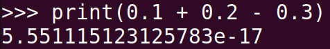
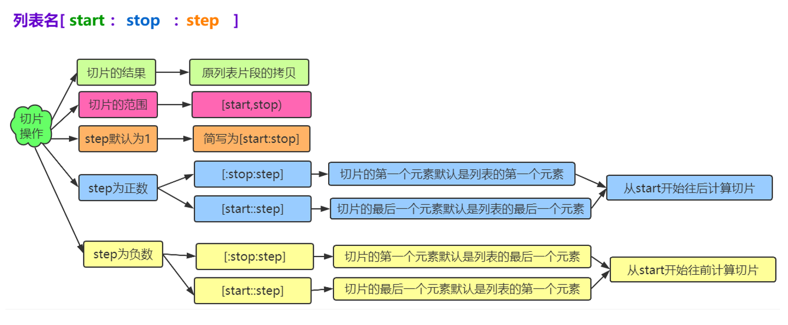
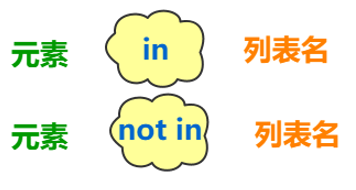
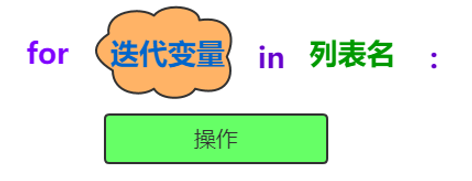
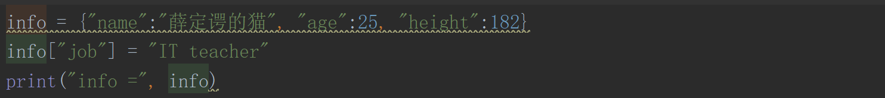
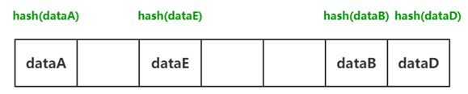
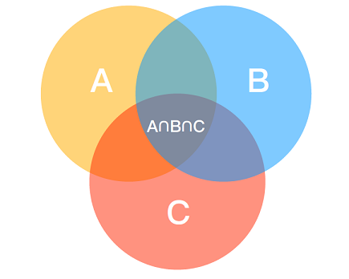
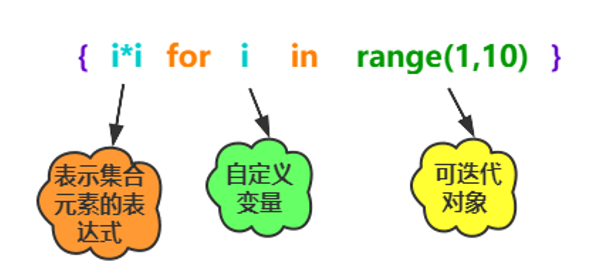

# 数据类型

* * 

```python
num1 = 1
print("num1 =", num1)

num2 = 2
print("num2 =", num2)

print("num1 + num2 =", num1 + num2)
print("num1 - num2 =", num1 - num2)
print("num1 * num2 =", num1 * num2)
print("num1 / num2 =", num1 / num2)
```

## 浮点型（float）

```python
f1 = 100.0
f2 = 98.0

print("f1 + f2 =", f1 + f2)


结果：
f1 + f2 = 198.0
```

**Python中小数精度问题**



> 我们发现，一个非常简单的数学运算，结果竟然是错的，难道Python有bug吗？

这是由于Python中浮点数都是以二进制形式存储的，将浮点数转化成二进制过程中，出现了无限循环情况，造成结果的不精确。

#### **浮点数转化成二进制**

* 0.25的二进制—— 0.01
* 0.8125的二进制——0.1101
* 0.1的二进制——0.00011001100110011001100110011001100110011001100110011001100

> python是以双精度来保存浮点数的，后面多余的会被砍掉，所以在电脑上实际保存的已经小于0.1的值了，后面拿来参与运算就产生了误差。

#### **解决方案decimal**

```python
from decimal import *

a = Decimal('0.1')
b = Decimal('0.2')
c = Decimal('0.3')

print(a + b - c)
```

## 字符串(String)


## 列表**(List)**

* `List`（列表） 是 `Python` 中使用 **最频繁** 的数据类型，在其他语言中通常叫做 **数组**
* 专门用于存储 **一串 信息**
* 列表用 `[]` 定义，**数据** 之间使用 `,` 分隔
* 列表的 **索引** 从 `0` 开始
  * **索引** 就是数据在 **列表** 中的位置编号，**索引** 又可以被称为 **下标**
  * 注意：从列表中取值时，如果 **超出索引范围**，程序会报错


#### 列表的创建


**列表切片**



```python
a = [1, 2, 3, 4, 5, "hello"]
print(a)        # [1, 2, 3, 4, 5, 'hello']

b = [i for i in range(1, 10)]
print(b)        # [1, 2, 3, 4, 5, 6, 7, 8, 9]

print(b[0])     # 1
print(b[-1])    # 9
print(b[1:3])   # [2, 3]
print(b[::3])   # [1, 4, 7]
print(b[::-1])  # [9, 8, 7, 6, 5, 4, 3, 2, 1]

b.append("yanpeng")     # [1, 2, 3, 4, 5, 6, 7, 8, 9, 'yanpeng']
print(b)

b.insert(9, "xu")
print(b)                # [1, 2, 3, 4, 5, 6, 7, 8, 9, 'xu', 'yanpeng']

b.extend("1314")
print(b)                # [1, 2, 3, 4, 5, 6, 7, 8, 9, 'xu', 'yanpeng', '1', '3', '1', '4']

b.append([10, 11, 12])
print(b)                # [1, 2, 3, 4, 5, 6, 7, 8, 9, 'xu', 'yanpeng', '1', '3', '1', '4', [10, 11, 12]]

ret = b.pop(2)
print(ret)              # 3
print(b)                # [1, 2, 4, 5, 6, 7, 8, 9, 'xu', 'yanpeng', '1', '3', '1', '4', [10, 11, 12]]

b.remove("yanpeng")
print(b)                # [1, 2, 4, 5, 6, 7, 8, 9, 'xu', '1', '3', '1', '4', [10, 11, 12]]

b[0] = 88
print(b)                # [88, 2, 4, 5, 6, 7, 8, 9, 'xu', '1', '3', '1', '4', [10, 11, 12]]

print(b.count(88))      # 1

print(b.index("xu"))    # 8

c = [3, 1, 2, 6, 5, 4]
c.reverse()             # [4, 5, 6, 2, 1, 3]
print(c)
c.sort()
print(c)                # [1, 2, 3, 4, 5, 6]
```

```python
# extend 和 append 区别
# extend 只能添加可迭代对象

a = [1, 2, 3]
a.append([4, 5, 6])
print(a)        # [1, 2, 3, [4, 5, 6]]

b = [1, 2, 3]
b.extend([4, 5, 6])
print(b)        # [1, 2, 3, 4, 5, 6]

c = [1, 2, 3]
c.extend(4)
print(c)

# 结果

>Traceback (most recent call last):
>  File "/Users/yan/Desktop/Py_Projects/19-11-10/demo1.py", line 47, in <module>
    c.end(4)
>TypeError: 'int' object is not iterableP
```

**列表查询**



**列表遍历**



**列表生成式**


## 元组（Tuple）

列表中的数据，任何时候都可以进行增删改查，然而，对于很多重要的不想被改变的数据来说，这个过程是不安全的，因此，我们用元祖这一数据类型来存储。

_只包含一个元组的元素需要使用逗号和小括号。_

```python
t1 = (1, 2, 3, 4, 5, "yan", "peng")
print(t1[0])        # 1
print(t1[1])        # 2
print(t1[1:3])      # (2, 3)
print(t1[::2])      # (1, 3, 5, 'peng')
print(t1[::-1])     # ('peng', 'yan', 5, 4, 3, 2, 1)
print(t1[:-1])      # (1, 2, 3, 4, 5, 'yan')

print(t1.index("yan"))      # 5
print(t1.count(1))          # 1
print(len(t1))              # 
```

如果元组中对象本身不可变对象，则不能再引用其它对象

如果元组中的对象是可变对象，则可变对象的引用不允许改变，但数据可以改变


## 字典（dict）

如果我们需要用一个变量记录多个值，但多个值是不同属性的，比如人的姓名、年龄、身高，用列表可以存，但列表是用索引对应值的，而索引不能明确地表示值的含义，这就用到字典类型，字典类型是用key：value形式来存储数据，其中key可以对value有描述性的功能。


```python
info = {"name":"薛定谔的猫", "age":25, "height":182}
print("info =", info)
print(info["name"])
print(info["age"])
print(info["height"])
print(info.items())
print(info.keys())
print(info.values())

输出结果：
info = {'name': '薛定谔的猫', 'age': 25, 'height': 182}
薛定谔的猫
25
182
dict_items([('name', '薛定谔的猫'), ('age', 25), ('height', 182)])
dict_keys(['name', 'age', 'height'])
dict_values(['薛定谔的猫', 25, 182])P
```

* 字典中数据必须以键值对形式出现
* 逻辑上讲，键是不能重复的，而值可以重复
* 字典中的键是不可变的，也就是无法修改的，而值是可变的，可修改的，可以是任意类型数据

```python
my_dict = {[]: "I am a list."}
print(my_dict)

# TypeError: unhashable type: 'list'y
```

#### 字典添加元素




## 集合(Set)






```python
a = {1, 2, 3, 'hello'}
b = set("python")
print(a, b)

if 'hello' in a:
    print("OK")

a.add(4)
print(a)
a.update({5, 6, 7})
print(a)
```

#### 删除操作

* 调用remove()方法，一次删除一个指定元素，如果指定的元素不存在抛出KeyError
* 调用discard()方法，一次删除一个指定元素，如果指定的元素不存在不抛异常
* 调用pop()方法，一次只删除一个任意元素
* 调用clear()方法，清空集合

#### 集合间关系


* 两个集合是否相等
  * 可以使用运算符==或!=进行判断
* 一个集合是否是另一个集合的子集
  * 可以调用方法issubset进行判断
* 一个集合是否是另一个集合的超集
  * 可以调用方法issuperset进行判断
* 两个集合是否没有交集
* 可以调用方法isdisjoint进行判断

**集合运算**

```python
a = {'a', 'b', 'c', 1, 2, 3}
b = {'a', 'b', 'd', 4, 5, 6}
print(a - b)
print(a | b)
print(a & b)
print(a ^ b)

结果：
{1, 2, 3, 'c'}
{'b', 2, 1, 3, 'd', 'c', 5, 4, 6, 'a'}
{'b', 'a'}
{1, 2, 3, 'd', 5, 4, 6, 'c'}y
```

#### 集合生成式




