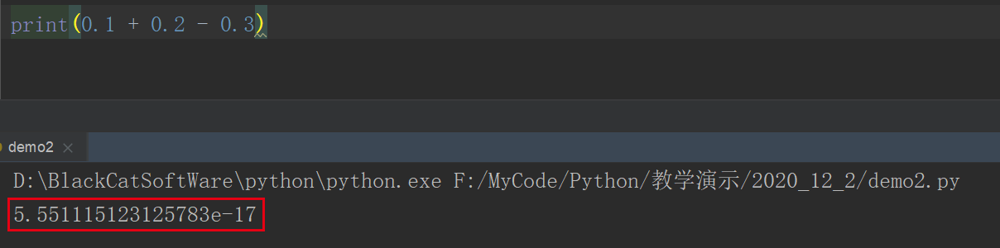

# 基础数据类型

## int 整形(integer)

* 整数类型：_英文为**integer**，简写为**int**，可以表示_正数、负数和零
* 整数的不同进制表示方式
  * 十进制->默认的进制
  * 二进制->以0b开头
  * 八进制->以0o开头
  * 十六进制->0x开头

```python
num1 = 1
print("num1 =", num1)

num2 = 2
print("num2 =", num2)

print("num1 + num2 =", num1 + num2)
print("num1 - num2 =", num1 - num2)
print("num1 * num2 =", num1 * num2)
print("num1 / num2 =", num1 / num2)
```

## 浮点型（float）

```python
f1 = 100.0
f2 = 98.0

print("f1 + f2 =", f1 + f2)


结果：
f1 + f2 = 198.0
```

**Python中小数精度问题**



> 我们发现，一个非常简单的数学运算，结果竟然是错的，难道Python有bug吗？

这是由于Python中浮点数都是以二进制形式存储的，将浮点数转化成二进制过程中，出现了无限循环情况，造成结果的不精确。

#### **浮点数转化成二进制**

* 0.25的二进制—— 0.01
* 0.8125的二进制——0.1101
* 0.1的二进制——0.00011001100110011001100110011001100110011001100110011001100

> python是以双精度（64bit）来保存浮点数的，后面多余的会被砍掉，所以在电脑上实际保存的已经小于0.1的值了，后面拿来参与运算就产生了误差。

#### **解决方案decimal**

```python
from decimal import *

a = Decimal('0.1')
b = Decimal('0.2')
c = Decimal('0.3')

print(a + b - c)
```

## 字符串(string)

