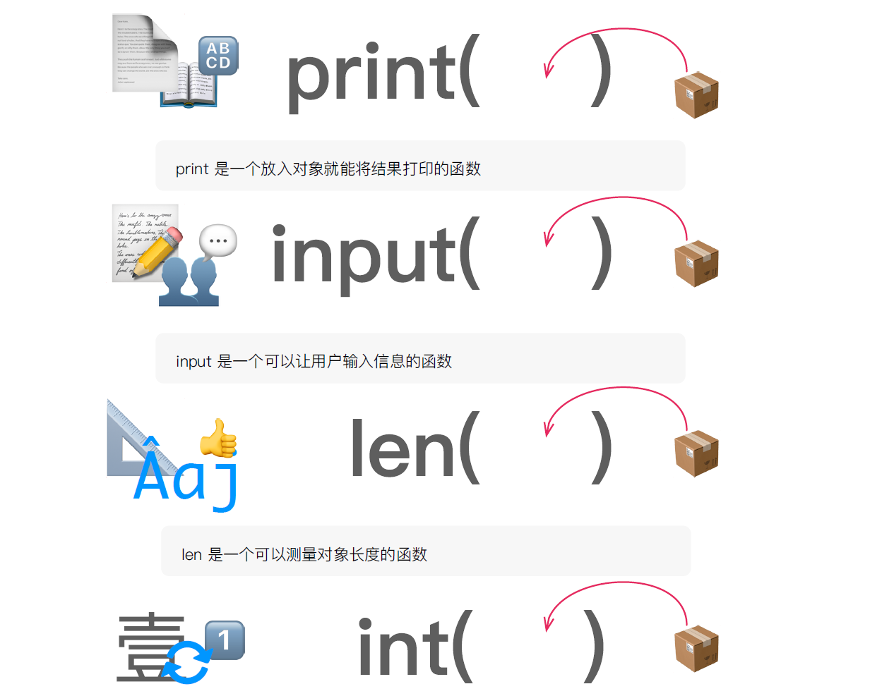
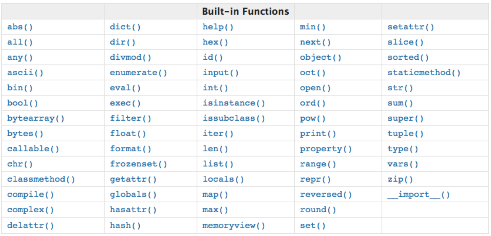
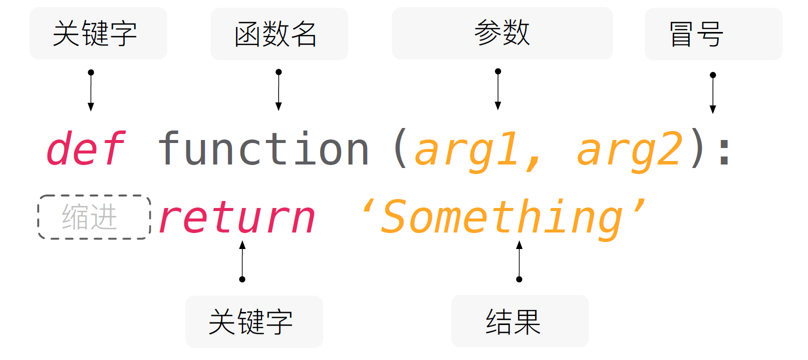

# 函数，模块化编程

函数是实现某一功能的模块，分为内置函数和自定义函数。





## 定义函数和调用函数



```python
def examination():

    print("打开试卷")
    print("写上名字徐筵彭")
    print("答题")
    print("检查")
    print("交卷")

examination()
```

## **函数传递参数**

****

* 函数，把 具有独立功能的代码块 组织为一个小模块，在需要的时候 调用
  * 函数的参数，增加函数的 通用性，针对 相同的数据处理逻辑，能够适应更多的数据
  * 在函数内部，把参数当做变量使用，进行需要的数据处理
* 函数调用时，按照函数定义的参数顺序，把 希望在函数内部处理的数据，通过参数 传递
  * 形参：定义函数时，小括号中的参数，是用来接收参数用的，在函数内部作为变量使用
  * 实参：调用函数时，小括号中的参数，是用来把数据传递到 函数内部用的

```python
def examination(name):

    print("打开试卷")
    print("写上名字:", name)
    print("答题")
    print("检查")
    print("交卷")

examination("徐筵彭")

结果：
打开试卷
写上名字: 徐筵彭
答题
检查
交卷
```


```python
def func(arg1, arg2):
    print("arg1 =", arg1)
    print("arg2 =", arg2)
    arg1 = 100
    arg2.append(10)
    print("arg1 =", arg1)
    print("arg2 =", arg2)

n1 = 11
n2 = [22, 33, 44]
print("n1 =", n1)
print("n2 =", n2)
func(n1, n2)
print("n1 =", n1)
print("n2 =", n2)P
```

## **函数的返回值**

* 在程序开发中，有时候，会希望 一个函数执行结束后，告诉调用者一个结果，以便调用者针对具体的结果做后续的处理
* 返回值是函数 完成工作后，最后给调用者的 一个结果
* 在函数中使用 return 关键字可以返回结果
* 调用函数一方，可以 使用变量来接收 函数的返回结果

```python
def add (a, b):
    return a + b

ret1 = add(1, 2)
ret2 = add("hello", "world")

print("ret1 =", ret1)
print("ret2 =", ret2)
```

